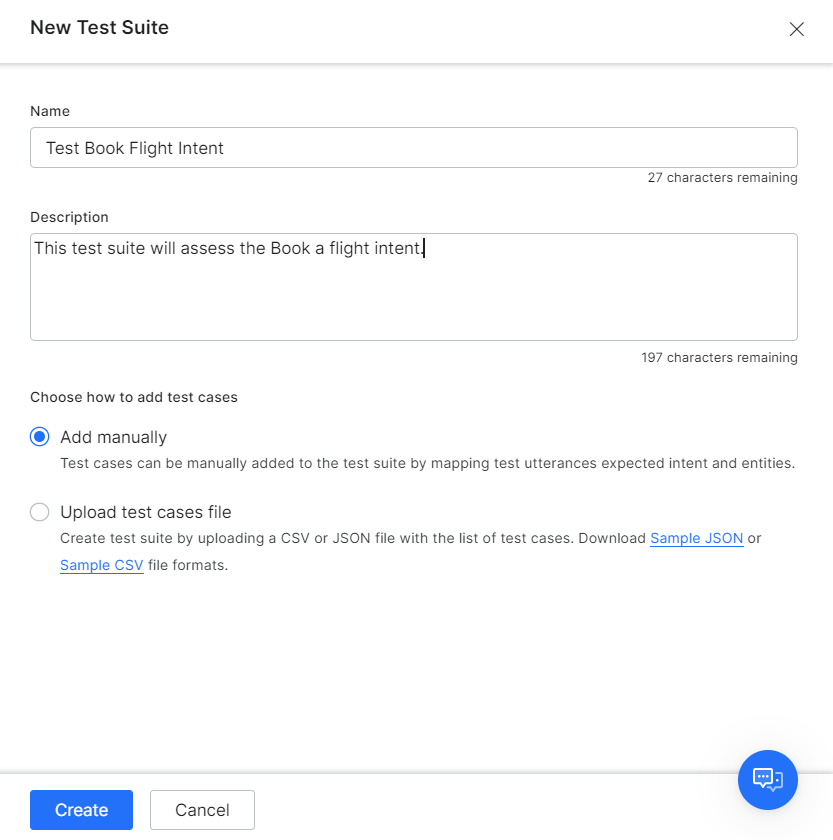
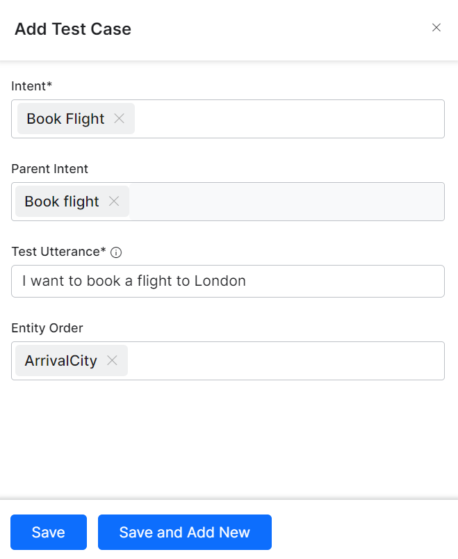
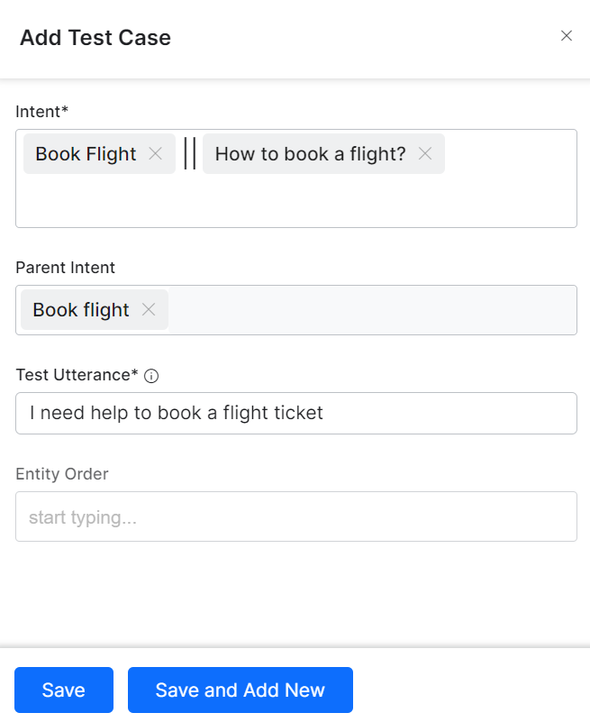
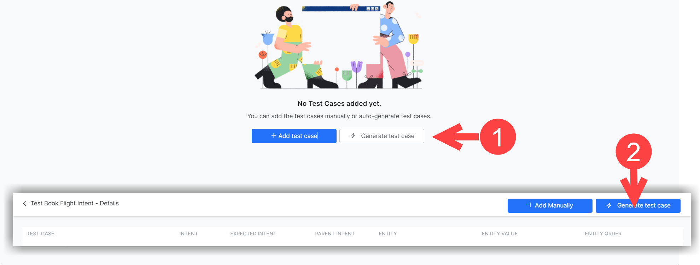
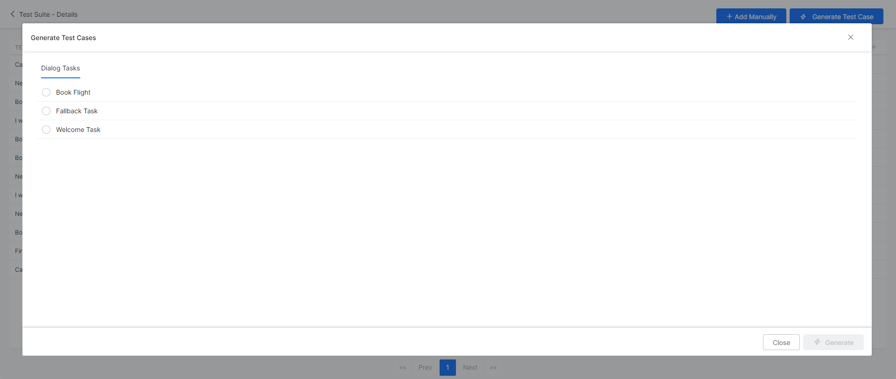
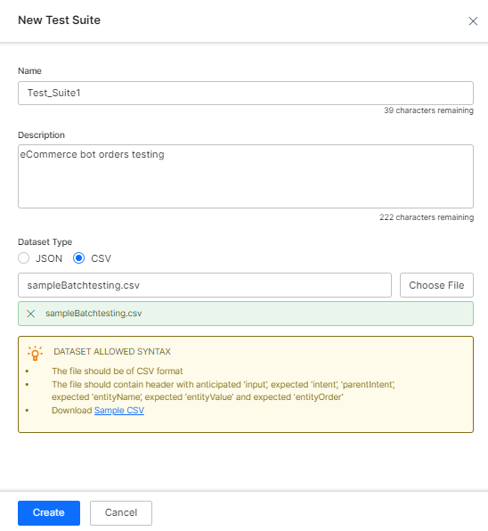
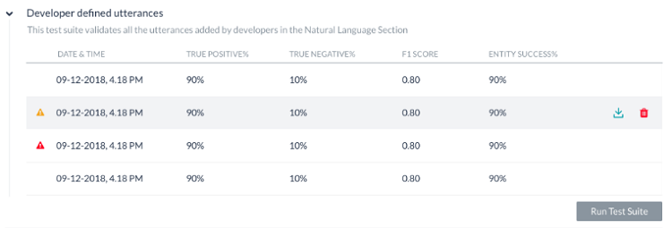
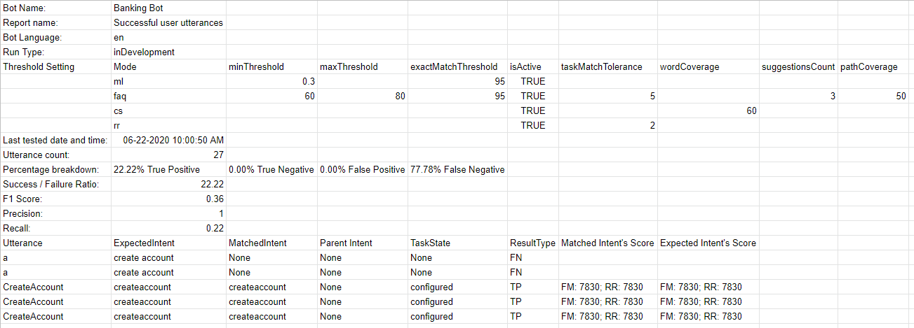

# **Batch Testing**

Once you have built and trained your bot, the most important question that arises is how good is your bot’s learning model? So, evaluating your bot’s performance is important to delineate how good your bot understands the user utterances.

The **Batch Testing** feature helps you discern the ability of your bot to correctly recognize the expected intents and entities from a given set of utterances. This involves the execution of a series of tests to get a detailed statistical analysis and gauge the performance of your bot’s ML model.

**Note**: The Batch Testing dashboard displays the summary of test coverage, performance, and training recommendations for multiple test suites based on validations of the intent identification capabilities of your NLU model. The **Health and Monitoring** dashboard is a one-stop place that displays this information for the individual test suite(s) the user selects. [Learn More](https://developer.kore.ai/docs/bots/analyzing-your-bot/virtual-assistants-health-and-monitoring/).

To conduct a batch test, you can use predefined test suites available in the builder or create your own custom test suites. Based on your requirement, the test suites can be run to view the desired results. This option can be accessed from the **Testing -> Batch Testing** option from the left navigation menu.


## **Best Practices**

* An optimal approach to bot NLP training is to first create a test suite of most of the use cases(user utterances) that the bot needs to identify, run it against the model and start training for the ones that failed.
* Create/update batch testing modules for high usage utterances.
* Publish the trained model only after detailed testing.
* When naming the intent, ensure that the name is relatively short (3-5 words) and does not have special characters or words from the Stop Wordlist. Try to ensure the intent name is close to what the users request in their utterance.
* Batch Test executions do not consider the context of the user. Hence you might see some False Negatives in the test results which in fact are True Positives in the actual bot when the context is taken into consideration.
* The ‘count’ in Batch Test results refers to the ‘unique assertion’ statements and not necessarily the number of the rows in the CSV file. Batch tests use a rule to validate the unique assertions based on the ‘utterance’ in consecutive rows. If two consecutive rows have same utterances and different entity values, the XO platform considers it as one assertion statement which accepts both the entity values.


## **Managing Test Suites**

Kore.ai provides a few out-of-the-box **Test Suites** to perform batch testing. **'Developer defined utterances’** and **'Successful user utterances’** are the built-in test suites that can be run to perform Batch Testing. You can also create a **New Test Suite** for testing a custom set of utterances.


### Developer defined utterances

This test suite validates the utterances that have been previously added and trained by the developer from Machine Learning Utterances screen. Using this test suite would mean testing collectively the entire set of utterances that a developer has added for all tasks of the bot.


### Successful user utterances

This test suite includes all the end-user utterances that have successfully matched one or more intents and the corresponding task is fully executed. You can also find these utterances from the ‘Intent found’ section of the Analyze module.


### Adding a New Test Suite

To add a new test suite, follow the steps below:

1. Go to **Build** > **Testing** > **Batch Testing**, and click **New Test Suite**.


2. In the **New test Suite** window, add a **name** and provide a **description**.
3. Next, choose how to add test cases: either manually or by uploading a test case file.
    * Selecting **Add Manually** lets you add test cases manually or use LLM and Generative AI to generate test cases automatically.
    * Selecting **Upload Test Cases File** lets you upload a file containing test cases.




#### Adding Test Cases Manually

Once you create a test suite to which you have chosen to add test cases manually, you can either add them manually or generate them automatically.

In the Test Cases page, click the **+Add Test Case**.


In the **Add Test Case** window, select or enter information in the following fields:

1. The **Intent** that corresponds to the Dialog Task you want to test. You can add/tag one or more intents to a test utterance. 
You can add up to three intents (Dialog, FAQ, or Small Talk) for a test utterance. It helps in scenarios where ambiguity is by-design and should be considered as True Positive. For example, for the utterance “I need help to book a flight ticket,” the expected intent can be either “Book flight” (Dialog) or “How to book a flight?” (FAQ).
2. The **Parent Intent** within that task.
3. **Test Utterances**: You can add multiple utterances, each on a new line.
4. The **Entity Order**: Select one from the available options, depending on the intent you are working with. You can only select one item. The Entity Order selection is not available if you have added multiple intents.

  **One Intent for a Test Utterance**
  

  **Multiple Intents for a Test Utterance**
  

5. Click **Save** when ready.
6. Once added, your test cases are listed and ready to run. You can use the **Add Manually** button at the top of the list to add more test cases. The option to Generate Test cases only displays if you have enabled LLM and Generative AI for the VA.


#### Generating Test Cases Automatically

You can automatically generate batch test cases if you have enabled [LLM and Generative AI ](https://developer.kore.ai/docs/bots/nlp/llm-and-generative-ai/)for your Virtual Assistant. You can access the feature either right after creating a new test case, as shown above, or from the test cases list.




##### Steps to Generate Test Cases

To generate test cases automatically, follow the steps below:


1. Click **Generate Test Cases** from any of the two areas mentioned above.
2. In the **Generate Test Case** window, select the **Dialog Task** you want to test. 
3. Click **Generate**. Wait for a few moments until the generation completes.



4. Once test cases are generated, you can reject some of them. If required, click Generate more to get more suggestions. 
5. Click **Add Test Cases** when ready.


Once you add the test cases, they are listed within your test suite, along with any other cases you might have added manually or generated in the past. You can continue adding test cases to the suite using these two methods.


#### Adding a Test Suite by Uploading a Test Cases File

If you **Upload a Test Cases File**, you can import an array of test utterances, also known as a Dataset at once in a batch file. The Dataset file must be in a CSV or JSON format and can have a maximum of 1000 utterances. You can download the sample CSV or JSON file formats while creating the test suite.

**Important Tip:** For a Universal Bot, to create a test suite, you can add multiple intents in the CSV/JSON file using the upload method. The format includes the intents and the corresponding bot names as follows:

```
{
"input": "Utterance",
"intent": "Intent 1|Intent 2|Intent 3",
"botName": "Bot 1|Bot 2|Bot 3"
}
```

**Example**

```
{
"input": "Need to check the multibot function",
"intent": "Age Predictor|IVRnode|Check Rephase",
"botName": "Check Bot|XOP211|Check Rephase"
}
```

The ability to create test suites manually is not yet available for universal bots.


**JSON Format for Test Suite**

The JSON format for creating custom suites allows you to define an array of test cases where each test case should consist of an utterance to be tested, the intent against which the utterance to be tested, and optionally define the list of expected entities to be determined from the utterance. If expected intent is a child intent, then you can also include the parent intent to be considered.

The sample code is given below:

```
{
    "testCases": [
    {
      "input": "Send 200 dollars to Leonardo",
      "intent": "Transfer Funds",
      "entities": [
        {
          "entityValue": "200 USD",
          "entityName": "TransferAmount"
        },
        {
          "entityValue": "Leonardo",
          "entityName": "PayeeName"
        }
      ],
      "entityOrder":["TransferAmount", "PayeeName"]
    },
    {
      "input": "What is the balance in my checking account",
      "intent": "Show Balance",
      "parentIntent": "Transfer Funds"
    },
    {
      "input": "Repeat this transfer every month",
      "intent": "Setup Auto Pay",
      "parentIntent": "Transfer Funds"
    },
    {
      "input": "Show my past 20 transactions",
      "intent": "Show Account Statement",
      "entities": [
        {
          "entityValue": "20",
          "entityName": "HistorySize"
        }
      ]
    },
    {
      "input": "Pay my credit card dues",
      "intent": "Pay Bill"
    },
	{
      "input": "I need to pay my monthly credit card bill",
      "intent": "Pay Bill | Setup Auto Pay | Transfer Funds"
    },
	{


      "input": "Open an account for me",
      "intent": "Open Account | How to Open Account?"
    },
    {
      "input": "looks like something is wrong in my statement",
      "intent":"trait: Account Statement||Issue||Account Type"
    },
    {
      "input": "How are you doing today",
      "intent":"emohowzit"
    },
    {
      "input": "Thank you",
      "intent":"thank~you"
    },
    {
      "input": "I understand",
      "intent":"i_understand"
    },
    {
      "input": "That's great",
      "intent":"~positiveackwords"
    },
    {
      "input": "How many people can you speak to at once?",
      "intent":"How many people can you speak to at once?"
    },
    {
      "input": "That's sweet",
      "intent":"That's sweet",
      "parentIntent": "How many people can you speak to at once?"
    },
    {
      "input": "What else can you do?",
      "intent":" What else can you do?",
      "parentIntent": "How many people can you speak to at once? >> That's sweet "
    },
    {
      "input": "What else can you do?",
      "intent":"What else"
    },
    {
      "input": "What's your age?",
      "intent":"How old are you?"
    },
    {
      "input": "Who created you?",
      "intent":"Who made you?"
    },
    {
      "input": "How many people talk to you?",
      "intent":"How many people can you speak to at once?"
    },
    {
      "input": "What's your name?",
      "intent":"What is your name?"
    },
    {
      "input": "What are you called?",
      "intent":"What ~you called?"
    }
  ]
}

```

* For Entities that have the Multi-Item enabled, values need to be given as: `entity1||entity2`
* Composite Entities require passing values in the following format: `component1name:entityValue|component2name:entityValue2`

The sample code is given below:

```
{
  "testCases": [
    {
      "input": "Add cart to Apples , Grapes",
      "intent": "Add to cart",
      "entities": [
        {
          "entityValue": "Apples||Grapes",
          "entityName": "LOV"
        }
       ]
     },
      {
         "input": "I booked a ticket from Hyderabad on July 6th, 2018 and it costed me Rs. 1200",
         "intent": "Book a flight",
         "entities": [
           {
            "entityValue": "City:Hyderabad|Date:2018-07-06}Curr:1200 INR",
            "entityName": "Composite5",      
           }
        ]
      }
   }
```

* The order in which the entities are to be extracted can be given as: `"entityOrder":["TransferAmount", "PayeeName"]`. 
If the order is not provided or partially provided, the platform determines the shortest route covering all the entities as the default order.

<table>
  <tr>
   <td>
<strong>PROPERTY NAME</strong>
   </td>
   <td><strong>TYPE</strong>
   </td>
   <td><strong>DESCRIPTION</strong>
   </td>
  </tr>
  <tr>
   <td>Test Cases
   </td>
   <td>Array
   </td>
   <td>Consists of the following:
<ul>

<li>input

<li>intent

<li>entities
</li>
</ul>
   </td>
  </tr>
  <tr>
   <td>input
   </td>
   <td>String
   </td>
   <td>End-user Utterance. Note that if any of the utterances are beyond 3000 characters, the file upload would be rejected.
   </td>
  </tr>
  <tr>
   <td>intent
   </td>
   <td>String
   </td>
   <td>Determine the objective of an end-user utterance (can be task name or primary question in case of FAQ test case)
<p>
Post-release 7.3, this property can be used to define traits to be identified against this utterance by using the prefix “<em>trait</em>” for example, <em>Trait: Trait Name1|| Trait Name2||Trait Name3</em>
<p>
Post-release 8.0, this property can include the expected Small Talk pattern.
   </td>
  </tr>
  <tr>
   <td>entities
   </td>
   <td>Array [Optional]
   </td>
   <td>Consists of an array of entities to be determined from the input sentence:
<ul>

<li>entityValue

<li>entityName
</li>
</ul>
   </td>
  </tr>
  <tr>
   <td>entityValue
   </td>
   <td>String
   </td>
   <td>Value of the entity expected to be determined from the utterance. You can define the expected Entity Value as a string or use a Regular Expression. For the purpose of Batch Testing, the platform flattens all entity values into string formats. 
   Please refer to the <a href="#entity-format-conversions">Entity Format Conversions</a> section for more information.
   </td>
  </tr>
  <tr>
   <td>entityName
   </td>
   <td>String
   </td>
   <td>Name of the entity expected to be determined from the utterance
   </td>
  </tr>
  <tr>
   <td>entityOrder
<p>
(ver7.1 onwards)
   </td>
   <td>Array [Optional]
   </td>
   <td>An array of entity names specifying the order in which the entities are to be extracted.
<p>
If the order is not provided or partially provided, the platform determines the shortest route covering all the entities as the default order.
   </td>
  </tr>
  <tr>
   <td>parentIntent
   </td>
   <td>String [Optional]
   </td>
   <td>Define parent intent to be considered if the intent is a sub-intent.
<p>
In the case of Small Talk, this field should be populated when the Small Talk is contextual follow-up intent; in case of multi-level contextual intent the parent intents should be separated by the delimiter ||
   </td>
  </tr>
</table>


**CSV Format for Test Suite**

CSV format for creating custom suites allows you to define test cases as records in CSV file where each test case should consist of an utterance to be tested, the intent against which the utterance to be tested, and optionally define entities to be determined from the utterance. If your test case requires more than one entity to be detected from a sentence, then you have to include an extra row for each of the additional entities to be detected. If expected intent is a child intent, then you can also include the parent intent to be considered.

```
input,intent,parentIntent,entityName,entityValue,entityOrder
Send 200 dollars to Leonardo, Transfer Funds,,TransferAmount,200 USD,,
,,,PayeeName,Leonardo, TransferAmount>PayeeName
What is the balance in my checking account,Show Balance, Transfer Funds,,,
Repeat this transfer every month, Setup Auto Pay, Transfer Funds,,,
Show my past 20 transactions, Show Account Statement,,HistorySize,20,,
Pay my credit card dues,Pay Bill,,,,,
```

* For Entities that have the Multi-Item enabled values need to be given as: `entity1||entity2`
* Composite Entities require the values in the following format:`component1name:entityValue|component2name:entityValue2`
Sample:

```
input,intent,parentIntent,entityName,entityValue
"Add cart to Apples , Grapes",Add to cart,LOV,Apples||Grapes,,
"I booked a ticket from hyderabad on July 6th, 2018 and it cost me Rs. 1200",Composite Test,Composite55,City5:Hyderabad|Date5:2018-07-06"|Curr5:1200 INR
```

* The order of extraction of entity value can be mentioned in the following format: `entity3>entity4>entity1`. 
If the order is not provided or partially provided, the platform determines the shortest route covering all the entities as the default order.

<table>
  <tr>
   <td>
<strong>COLUMN NAME</strong>
   </td>
   <td><strong>TYPE</strong>
   </td>
   <td><strong>DESCRIPTION</strong>
   </td>
  </tr>
  <tr>
   <td>input
   </td>
   <td>String
   </td>
   <td>Utterance given by the end-user. Note that if any of the utterances are beyond 3000 characters, the file upload would be rejected.
   </td>
  </tr>
  <tr>
   <td>intent
   </td>
   <td>String
   </td>
   <td>Determine the objective of an end-user utterance (can be task name or primary question in case of FAQ test case)
<p>
Post release 7.3, this property can be used to define traits to be identified against this utterance by using the prefix “<em>trait</em>” for example, <em>Trait: Trait Name1|| Trait Name2||Trait Name3</em>
<p>
Post-release 8.0, this property can include the expected Small Talk pattern.
   </td>
  </tr>
  <tr>
   <td>parentIntent
   </td>
   <td>String [Optional]
   </td>
   <td>Define parent intent to be considered if the intent is a sub-intent
<p>
In the case of Small Talk, this field should be populated when the Small Talk is contextual follow-up intent and the intent would be matched assuming that the follow-up intent criteria is met; in the case of multi-level contextual intent the parent intents should be separated by the delimiter ||
   </td>
  </tr>
  <tr>
   <td>entityValue
   </td>
   <td>String [Optional]
   </td>
   <td>Value of the entity expected to be determined from the utterance. You can define the expected Entity Value as a string or use a Regular Expression. For the purpose of Batch Testing, the platform flattens all entity values into string formats. Please refer to the <a href="#entity-format-conversions">Entity Format Conversions</a> section for more information.

   </td>
  </tr>
  <tr>
   <td>entityName
   </td>
   <td>String [Optional]
   </td>
   <td>Name of the entity expected to be determined from the utterance
   </td>
  </tr>
  <tr>
   <td>entityOrder
<p>
(ver7.1 onwards)
   </td>
   <td>Array [Optional]
   </td>
   <td>An array of entity names separated by > specifying the order in which the entities are to be extracted.
<p>
If the order is not provided or partially provided, the platform defines the implicit order to process first the NER and pattern entities and then the remaining entities.
   </td>
  </tr>
</table>


#### Entity Format Conversions

<table>
  <tr>
   <td><strong>ENTITY TYPE</strong>
   </td>
   <td><strong>SAMPLE ENTITY VALUETYPE</strong>
   </td>
   <td><strong>VALUE IN FLAT FORMAT</strong>
   </td>
   <td><strong>ORDER OF KEYS</strong>
   </td>
  </tr>
  <tr>
   <td>Address
   </td>
   <td>P.O. Box 3700 Eureka, CA 95502
   </td>
   <td>P.O. Box 3700 Eureka, CA 95502
   </td>
   <td>
   </td>
  </tr>
  <tr>
   <td>Airport
   </td>
   <td>{ “IATA”: “IAD”, “AirportName”: “Washington Dulles International Airport”, “City”: “Washington D.C.”, “CityLocal”: “Washington”, “ICAO”: “KIAD”, “Latitude”: “38.94”, “Longitude”: “-77.46” }
   </td>
   <td>Washington Dulles International Airport IAD KIAD 38.94 -77.46 Washington D.C. Washington
   </td>
   <td>AirportName IATA ICAO Latitude Longitude City CityLocal
   </td>
  </tr>
  <tr>
   <td>City
   </td>
   <td>Washington
   </td>
   <td>Washington
   </td>
   <td>
   </td>
  </tr>
  <tr>
   <td>Country
   </td>
   <td>{ “alpha3”: “IND”, “alpha2”: “IN”, “localName”: “India”, “shortName”: “India”, “numericalCode”: 356}
   </td>
   <td>IN IND 356 India India
   </td>
   <td>alpha2 alpha3 numericalCode localName shortName
   </td>
  </tr>
  <tr>
   <td>Company or Organization Name
   </td>
   <td>Kore.ai
   </td>
   <td>Kore.ai
   </td>
   <td>
   </td>
  </tr>
  <tr>
   <td>Color
   </td>
   <td>Blue
   </td>
   <td>Blue
   </td>
   <td>
   </td>
  </tr>
  <tr>
   <td>Currency
   </td>
   <td>[{ “code”: “USD”, “amount”: 10 }]
   </td>
   <td>10 USD
   </td>
   <td>amount code
   </td>
  </tr>
  <tr>
   <td>Date
   </td>
   <td>2018-10-25
   </td>
   <td>2018-10-25
   </td>
   <td>
   </td>
  </tr>
  <tr>
   <td>Date Period
   </td>
   <td>{ “fromDate”: “2018-11-01”, “toDate”: “2018-11-30” }
   </td>
   <td>2018-11-01 2018-11-30
   </td>
   <td>fromDate toDate
   </td>
  </tr>
  <tr>
   <td>Date Time
   </td>
   <td>2018-10-24T13:03:03+05:30
   </td>
   <td>2018-10-24T13:03:03+05:30
   </td>
   <td>
   </td>
  </tr>
  <tr>
   <td>Description
   </td>
   <td>Sample Description
   </td>
   <td>Sample Description
   </td>
   <td>
   </td>
  </tr>
  <tr>
   <td>Email
   </td>
   <td>user1@emaildomain.com
   </td>
   <td>user1@emaildomain.com
   </td>
   <td>
   </td>
  </tr>
  <tr>
   <td>List of Items(Enumerated)
   </td>
   <td>Apple
   </td>
   <td>Apple
   </td>
   <td>
   </td>
  </tr>
  <tr>
   <td>List of Items(Lookup)
   </td>
   <td>Apple
   </td>
   <td>Apple
   </td>
   <td>
   </td>
  </tr>
  <tr>
   <td>Location
   </td>
   <td>{ “formatted_address”: “8529 Southpark Cir #100, Orlando, FL 32819, USA”, “lat”: 28.439148,”lng”: -81.423733 }
   </td>
   <td>8529 Southpark Cir #100, Orlando, FL 32819, USA 28.439148 -81.423733
   </td>
   <td>formatted_address lat lng
   </td>
  </tr>
  <tr>
   <td>Number
   </td>
   <td>100
   </td>
   <td>100
   </td>
   <td>
   </td>
  </tr>
  <tr>
   <td>Person Name
   </td>
   <td>Peter Pan
   </td>
   <td>Peter Pan
   </td>
   <td>
   </td>
  </tr>
  <tr>
   <td>Percentage
   </td>
   <td>0.25
   </td>
   <td>0.25
   </td>
   <td>
   </td>
  </tr>
  <tr>
   <td>Phone Number
   </td>
   <td>+914042528888
   </td>
   <td>+914042528888
   </td>
   <td>
   </td>
  </tr>
  <tr>
   <td>Quantity
   </td>
   <td>{ “unit”: “meter”, “amount”: 16093.4, “type”: “length”, “source”: “10 miles” }
   </td>
   <td>16093.4 meter length 10 miles
   </td>
   <td>amount unit type source
   </td>
  </tr>
  <tr>
   <td>String
   </td>
   <td>Sample String
   </td>
   <td>Sample String
   </td>
   <td>
   </td>
  </tr>
  <tr>
   <td>Time
   </td>
   <td>T13:15:55+05:30
   </td>
   <td>T13:15:55+05:30
   </td>
   <td>
   </td>
  </tr>
  <tr>
   <td>Time Zone
   </td>
   <td>-04:00
   </td>
   <td>-04:00
   </td>
   <td>
   </td>
  </tr>
  <tr>
   <td>URL
   </td>
   <td>https://kore.ai
   </td>
   <td>https://kore.ai
   </td>
   <td>
   </td>
  </tr>
  <tr>
   <td>Zip Code
   </td>
   <td>32819
   </td>
   <td>32819
   </td>
   <td>
   </td>
  </tr>
</table>


##### Importing a Dataset file

1. Click **New Test Suite** on the batch testing page. A dialog box to import the dataset appears.
2. Enter a **Name, Description,** and choose a **Dataset Type** in the respective boxes for your dataset file.
3. To import the Dataset file, click **Choose File** to locate and select a JSON or CSV file containing the utterances as per the Dataset Type selected.



4. Click **Create**. The dataset file is displayed as an option to run the test suite on the Batch Testing page:


### Running Test Suites

The following steps guide you on how to run a batch test on your bot and get a detailed analytical report on the utterances based on the test results. To get started, go to Build > Testing > **Batch Testing**.

!!! note

    Before testing, it is essential to add and train your bot with a considerable number of utterances using Machine Learning.


To run a Test Suite, follow the steps below:

1. Click the desired test suite name in the **Batch Testing** window.  
Note that **Developer Defined Utterances** and **Successful User Utterances** are default test suites to validate user utterances through Batch Testing.
2. Select **In Development** to run batch tests on test suites for only the **_in-development_** version of the Virtual Assistant(s). Alternatively, select **Published** to run batch tests on test suites for only the published version of the Virtual Assistant(s).
3. Click **Run Test Suite** to initiate the batch test execution. 


#### Execution of Newly Created Batch Test Suites

Once you create a new test batch test suite, by default, the system automatically initiates test run execution for both **_In-development_** and **_Published_** VA versions. This makes it convenient to assess test results while the VA is in development and once a VA is published following a production release.


#### View Test Case Details

Running a test suite will display the results as described below.

**Note:** The test case with multiple intents is considered a test case for all the intents mentioned. For example, if a test case has Intent 1 and Intent 2 as expected intents, then Intent 1 and Intent 2 are shown as covered in the batch test summary.

Each test run creates a test report record and displays a summary of the test result. The batch test result in the screenshot below includes the following information:

* **Last Run Date & Time** that displays the date and time of the latest test run.
* **F1 Score** is the weighted average of Precision and Recall i.e. (2*precision*recall)/(precision+recall).
* **Precision** is the number of correctly classified utterances divided by the total number of utterances that got classified (correctly or incorrectly) to an existing task ie the ratio of true positives to all classified positives (sum of true and false positives) i.e. TP/(TP+FP).
* **Recall** is the number of correctly classified utterances divided by the total number of utterances that got classified correctly to any existing task or classified incorrectly as an absence of an existing task ie the ratio of correctly classified utterances to actual matching intents/tasks (sum of true positives and false negatives) i.e. TP/(TP+FN).
* **Intent Success %** that displays the percentage of correct intent recognition that has resulted from the test.
* **Entity Success %** that displays the percentage of correct entities recognized that has resulted from the test.
* **Version Type** identifies the version of the bot against which the test suite was run – development or published.
* There are three possible outcomes from each test run:
    1. Success – when all records are present in the file are processed
    2. Success with a warning – when one or more records present in the suite are discarded from detection due to system error
    3. Failed – when there was a system error and the test could not be resumed post-recovery.
* Hovering over the warning/error icon will display a message suggesting the reason.




#### Download a CSV Report

To get a detailed analysis of the test run, click **the Download** icon to download the test report in CSV format. You have an option to delete the test results if needed. The top section of the report comprises the summary with the following fields:

* **Bot Name**
* **Report name** of the test suite
* **Bot Language** (post 7.3 release)
* **Run Type** identifies the version of the bot against which the test suite was run – development or published.
* **Threshold Setting** (post 7.3 release) detailing the NLP thresholds applied when running this test suite, this would be followed by the settings for each of the three NL engines with the following details:
    * **Mode** – ml, faq, or, cs
    * **minThreshold**
    * **maxThreshold**
    * **exactMatchThreshold**
    * **isActive**
    * **taskMatchTolerance**
    * **wordCoverage**
    * **suggestionsCount**
    * **pathCoverage**
* **Last Tested:** Date of the latest test run for developer-defined utterances.
* **Utterance Count:** Total number of utterances included in the test run.
* **Success/Failure Ratio:** Total number of successfully predicted utterances divided by the total count of utterances multiplied by 100.
* **True Positive (TP):** Percentage of utterances that have correctly matched expected intent.In the case of Small Talk, TP is indicated when the list of expected and actual intents are the same.In the case of Traits, a TP state includes the traits matched over and above the expected matches.
**Note** that when you tag multiple intents (dialog, FAQ, and small talk) to a test utterance, the test result appears as TP if the actual intents match the expected intents but also include ambiguous intents.
* **True Negative (TN):** Percentage of utterances that were not expected to match any intent and they did not match. Not applicable to Small Talk.
* **False Positive (FP):** Percentage of utterances that have matched an unexpected intent. In the case of Small Talk, it would be when the list of expected and actual intents are different.
* **False Negative (FN):** Percentage of utterances that have not matched expected intent. In the case of Small Talk, it would be when the list of expected Small Talk intent is blank but the actual Small Talk is mapped to an intent.



The report also provides detailed information on each of the test utterances and the corresponding results.

* **Utterances**- Utterances used in the corresponding test suite.
* **Expected Intent**– The intent expected to match for a given utterance, will include trait where applicable with trait prefix
* **Matched Intent** – The intent that is matched for an utterance during the batch test. This will include matched traits with trait prefix (post 7.3 release). This will include matched Small Talk intents (post 8.0 release).
* **Parent Intent** – The parent intent considered for matching an utterance against an intent.
* **Task State** – The status of the intent or task against which the intent is identified. Possible values include Configured or Published
* **Result Type**– Result categorized as True Positive or True Negative or False Positive or False Negative
* **Entity Name** – The name of the entity detected from the utterance.
* **Expected EntityValue** – The entity value expected to be determined during the batch test.
* **Matched EntityValue** – The entity value identified from an utterance.
* **Entity Result** – Result categorized as True or False to indicate whether the expected entity value is the same as the actual entity value.
* **Expected Entity Order** – entity values from the input file
* **Actual Entity Order** –
    * if the order for all expected entities is provided, then the same is included in this column
    * if no order is provided, the system determined order will be included in the column
    * If an order is provided for some entities, then a combination of user-defined order and system-defined order will be included
* **Matched Intent’s Score** – For False Positives and False Negatives, the confidence scores from FM, ML, and/or KG engines are displayed for the matched intent from the utterance. Note that the scores are given only if the engine detects the intent, which means that you may not see the scores from all three engines at all times.
* **Expected Intent’s Score** – For False Positives, the confidence scores for the intent expected to match for the given utterance is given. Again the score will be given by the engines detecting the intent.

!!! tip

    For any of the batch tests, if results indicate that your bot is unable to recognize the correct intents, you can work on improving its performance by adding or modifying utterances to the Machine Learning model.


#### Batch Test Results for Universal Bots

The XO Platform now displays Batch Test Results for Universal bots for each test run in the summary view for [FAQs](https://developer.kore.ai/docs/bots/analyzing-your-bot/virtual-assistants-health-and-monitoring/#NLP-_FAQs_Summary), [Dialog Intents](https://developer.kore.ai/docs/bots/analyzing-your-bot/virtual-assistants-health-and-monitoring/#Dialog_Intent_Summary), and [Small Talk](https://developer.kore.ai/docs/bots/analyzing-your-bot/virtual-assistants-health-and-monitoring/#NLP-_Small_Talk_Summary) during Batch Testing. The actionable insights help understand the test coverage and NLP performance for each intent type in the Universal Bot. [Learn more](https://developer.kore.ai/docs/bots/analyzing-your-bot/virtual-assistants-health-and-monitoring/#NLP_Batch_Test_Results_Summary_for_Universal_Bots).


#### View Individual Test Run Summary

You can view the individual Batch Test Run summary of a test suite by clicking the **View Summary** icon of a test as shown below.


This displays the relevant NLP and Flow Health metrics on the **Health and Monitoring** Dashboard for intents mapped to Dialogs, FAQs, and Traits. [Learn More](https://developer.kore.ai/docs/bots/analyzing-your-bot/virtual-assistants-health-and-monitoring/#Test_Coverage).