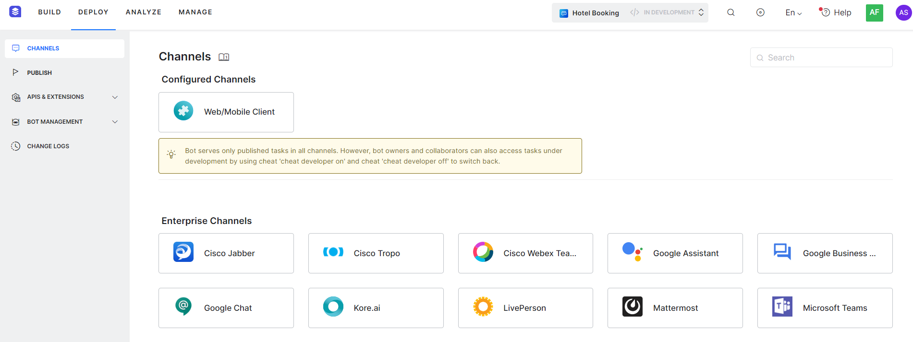
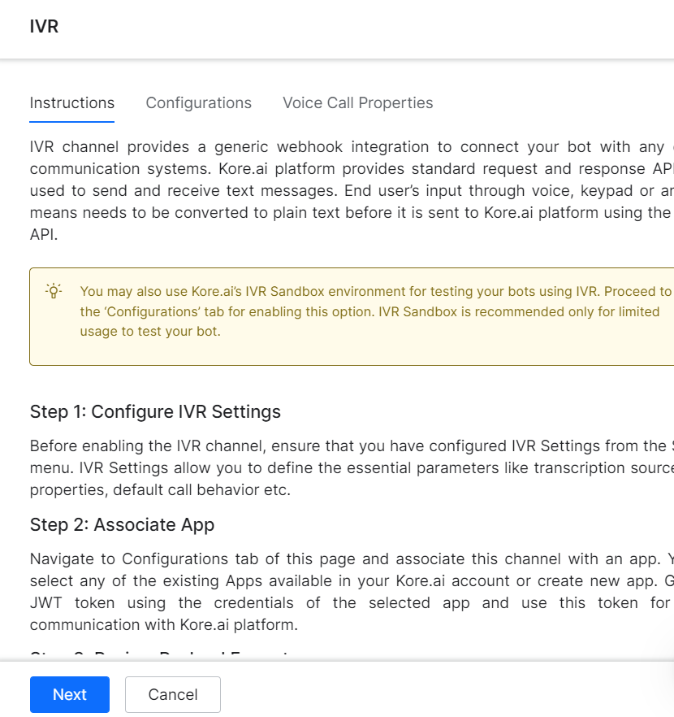
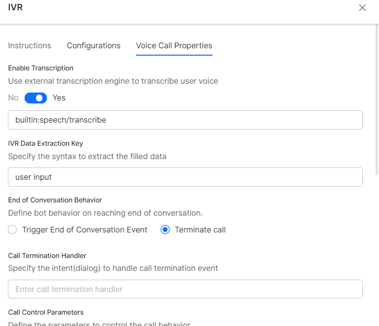
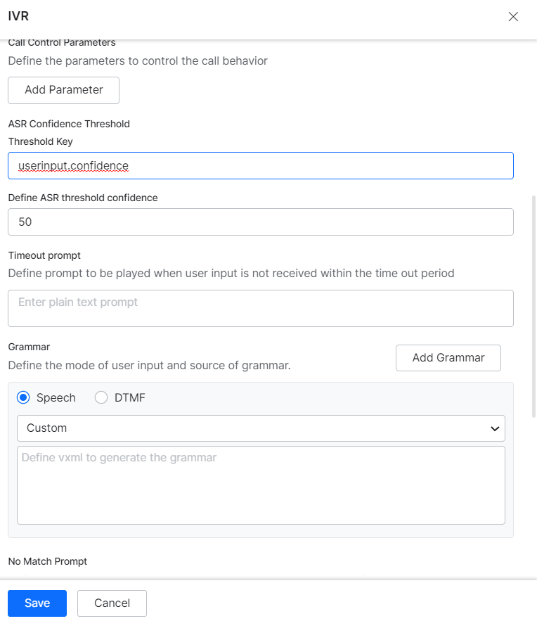
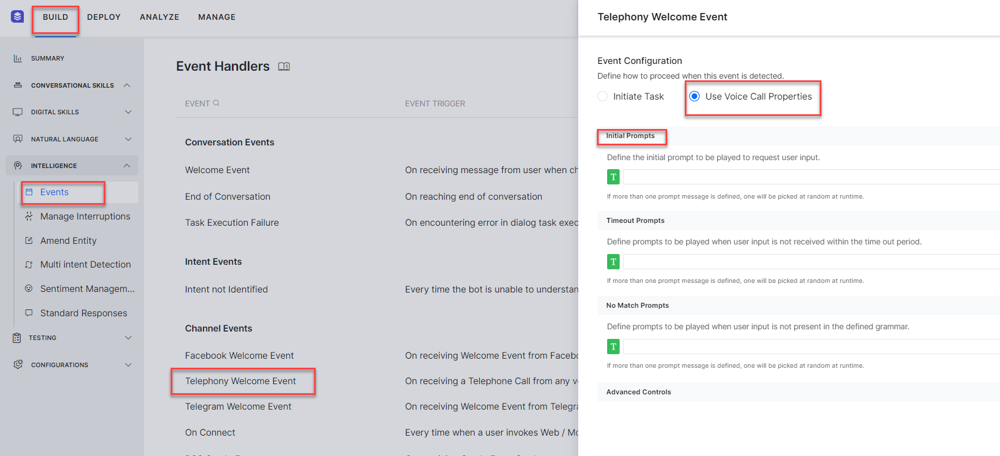
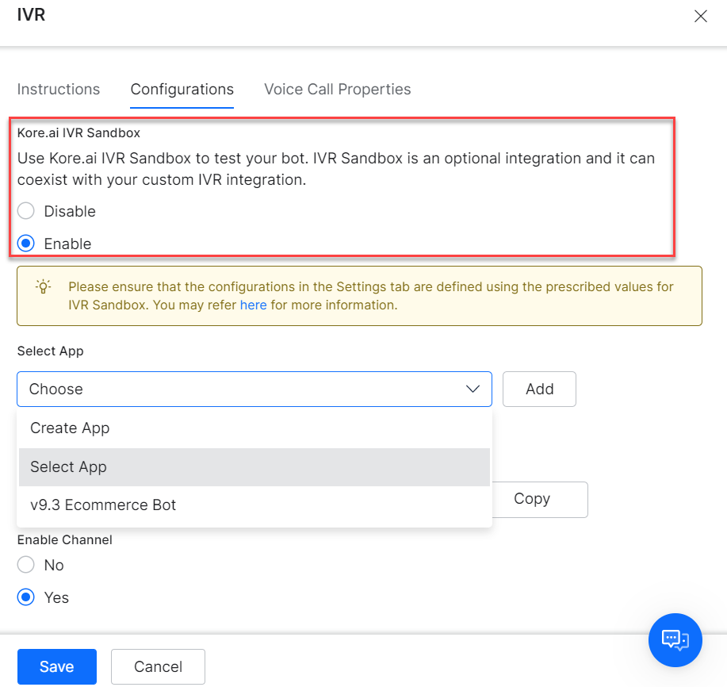
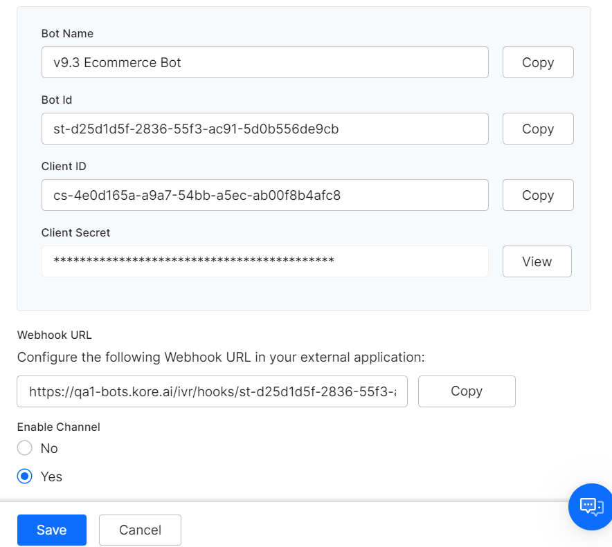
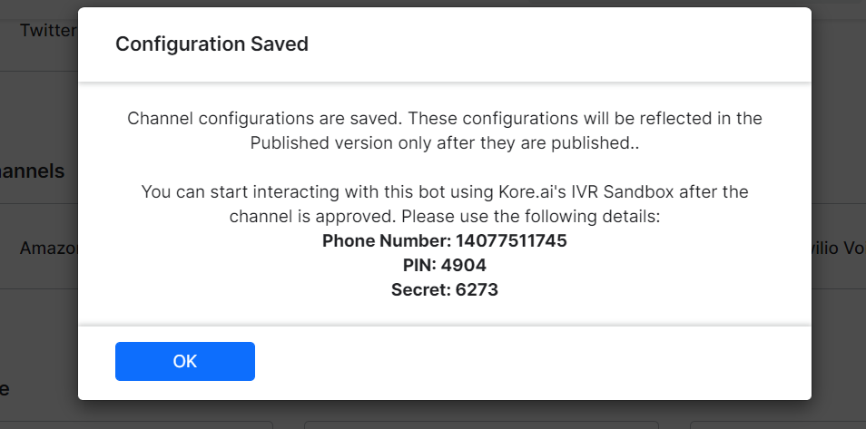
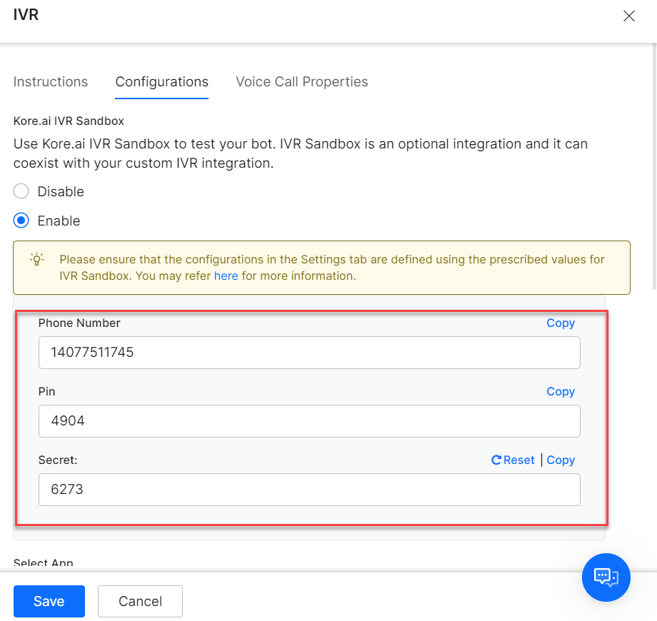
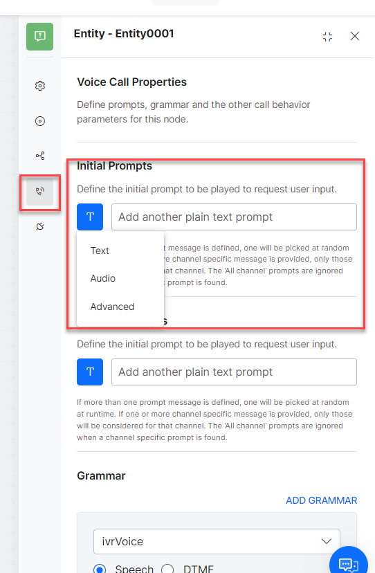

# **IVR Integration**

Interactive Voice Response (IVR) systems are preferred in many leading organizations to automate customer interactions. However, if you are using an IVR  system, you may often encounter the following two issues:


* **Non-Intuitive Interface**: IVR systems do not simply let the customers state their needs, they make the users go through an extensive list of menu options, from which customers must select before finding the intent. Even if they allow users to express their intent at first, the backend programs can only understand a limited number of phrases.
* **Static Flows**: IVR systems use static call flows that do not align with the nonlinear and contextual nature of human interactions. Following is a scenario where a customer is trying to Book Flight tickets:

    ```
    User: Book me a ticket to NYC
    IVR: Sure, for which date?
    User: Wait, will it rain there this Sunday?
    IVR: Sorry, I don't understand the input.
    ```

Conventional IVR systems do not have diversified options for the users to articulate their requests beyond the rigid program flows.


## Kore.ai IVR Support

Kore.ai XO Platform allows you to give a conversational makeover to your IVR system. It lets you build Virtual Assistants with human-like conversation capabilities and integrate them with your existing IVR system, thus taking your organization’s customer service experience to a new level.

The following features enable  the seamless integration of your Kore.ai VAs with your existing IVR:

* **Native VXML Support**: Built-in support to parse and generate World Wide Web Consortium (W3C) compliant Voice Extensible Markup Language(VXML) files.
* **Hybrid integration**: Flexibility to build use cases or dialogs on the  Kore.ai Experience Optimization (XO) Platform, which can work in sync with the IVR dialogs.
* **Discourse Analyzer**: Kore.ai’s discourse analyzer helps enterprises generate conversation flows using historical chat or call transcripts. Chat and call transcripts are analyzed using neural network-based machine learning models to identify intents and discourse patterns to fulfill a specific intent. This is an out-of-the-box feature that is in Beta state. Contact our [support team](http://support.kore.ai/) if you want to try this feature.
* **Granular Call Flow Support**: Ability to define all the call flow elements such as grammar, prompts, retry and time-out periods. Kore.ai supports call termination handlers, and allows you to end calls or invoke dialogs in case of exceptions.


## IVR Set Up

To setup IVR integration, perform the following steps:

1. **[Configure IVR Settings](https://developer.kore.ai/docs/bots/advanced-topics/ivr-integration/ivr-integration/#Configure_IVR_Settings)**: Define IVR settings such as transcription options, welcome messages, standard responses, and VXML properties.
2. **[Configure Dialog Node IVR Properties](https://developer.kore.ai/docs/bots/advanced-topics/ivr-integration/ivr-integration/#Configure_Dialog_Node_IVR_Properties)**: Define dialog by configuring node-specific grammar, prompts, and call flow behavior like time-out, retries.
3. **[IVR Channel Setup](https://developer.kore.ai/docs/bots/advanced-topics/ivr-integration/ivr-integration/#IVR_Channel_Setup)**: Set up authentication, configure WebHook in your IVR system and enable channel.


### Configure IVR Settings

This section explains the IVR settings you need to configure for your Virtual Assistant (VA). As a first step, you must enable the IVR settings for the VA and define the **Transcription **options and **VXML **properties. These settings act as the default for the VA. You can override VXML properties configured at the VA level by defining custom values at the node level of the Dialog tasks.

Steps to configure IVR settings for your Virtual Assistant:

1. Open the VA for which you want to integrate the IVR.
2. Go to the **Deploy **tab from the top menu.
3. The **Channels** page is displayed. Locate and click the **IVR** under Voice Channels. \
  
  
  The IVR Panel with **Instructions** is displayed.
  
4. On the **Configurations** tab, perform the following steps:
5. Use **Kore.ai IVR Sandbox** for testing your VA. See [Sandbox Configuration ](https://developer.kore.ai/docs/bots/advanced-topics/ivr-integration/ivr-integration/#ivr-sandbox)for more details.

6. Associate an App with the IVR channel, either by creating a new one or selecting an existing one. If you do not have any apps, a message is displayed as shown in the following screenshot.

   

7. Use the **WebHook URL** provided in your external application.
8. Enter the details to complete the setup, see [Voice Call Properties: Channel Settings](https://developer.kore.ai/docs/bots/bot-builder-tool/dialog-task/voice-call-properties/#Channel_Settings) for more information.
   
9. From the **Voice Call Properties** tab, set the configurations.

10. The Platform supports all UniMRCP-encoded voice-to-text services. If you select the **Enable Transcription** option for the VA, then the platform allows you to skip defining grammar during configuring IVR settings for any node (described in [Configure Dialog Node IVR Properties](https://developer.kore.ai/docs/bots/advanced-topics/ivr-integration/ivr-integration/#Configure_Dialog_Node_IVR_Properties)).
See [Voice Call Properties: Configuring Grammar](https://developer.kore.ai/docs/bots/bot-builder-tool/dialog-task/voice-call-properties/#Configuring_Grammar) for a detailed configuration for Grammar syntax.

!!! note

    If you already have created apps, then select an app from the Select App drop-down or create a new app. See Sandbox Configuration steps to know more.

!!! note

    If you have enabled IVR Sandbox, the following settings are required to be configured on the platform. These are pre-populated if you do not enable the IVR settings. In case you have enabled the settings, ensure the values are the same as follows:
     – Enable Transcription set to Yes.
     – Transcription engine source set to builtin:speech/transcribe.
     – IVR Data Extraction Key set to user input.
     – ASR Confidence Threshold Key set to userinput confidence.
     – ASR Threshold Confidence set to 50.
   
   

!!! note

    Sandbox may not respond as expected if you use different values.

!!! note

    If you save the configuration after associating  an app without enabling IVR Settings, the  platform pre-populates the required settings for Sandbox.

Once you have enabled the IVR channel, configure the **Telephony Welcome Event** in IVR Settings. This plays a welcome message for users when they connect to the VA through the IVR channel.

Steps to configure Telephony Welcome Event:


1. Under the **Build** tab, select **Intelligence > Events**.
2. Select the **Use Voice Call Properties** option to open the voice settings section.
3. Under the **Initial Prompts** text field, enter the message that needs to be played when the user connects to the VA. To know more about other configuration fields, see the [Voice Call Properties: Dialog Node Settings](https://developer.kore.ai/docs/bots/bot-builder-tool/dialog-task/voice-call-properties/#Dialog_Node_Settings) section.


#### Sandbox Configuration

!!! note

    This option was introduced in ver 7.1 of the platform. It is not available for on-prem installation.

Kore.ai XO Platform offers an **IVR Sandbox environment** to instantly launch your VA for interactions over voice calls. This is useful when a working IVR system is not available for testing your VA over a voice channel. IVR Sandbox is an optional integration and it can coexist with your custom IVR integration.

Enabling this option generates a** Phone Number, Pin, **and **Secret**. To develop and test it with your teams, you can call your VA by using the phone number and PIN allocated for your VA. On receiving the valid Pin and Secret you will be connected with the VA for interactions. See the following steps to understand the Sandbox configuration.

1. To enable the Sandbox, select **Enable** for **Kore.ai IVR Sandbox** under the **Configurations** tab .

  

2. In the **Select App** drop-down, select an existing app or create a new app by clicking the **Add** button or choosing the **Create App** option.
3. The details are populated for an existing app, as shown in the following screenshot.
  
4. Click **Save**.
5. The following pop-up is displayed for the new app creation. Enter the details and click **Create** to create the app.
  
6. Upon saving the details, the following pop-up is displayed with **Phone Number, PIN** and **Secret** values. Click **OK**.
7. Once enabled, you can access the IVR Sandbox interaction details by clicking the **Test**
button, which becomes visible upon hovering over the IVR icon under the **Configured Channels**.
 
 
8. On clicking **Test**, the following pop-up is displayed.


The **Phone Number**, **PIN**, and **Secret** are populated in the IVR Configurations panel as shown in the following screenshot.


**IVR Sandbox Limitations:**

* The platform supports only a limited number of concurrent lines, hence calls to your VAs through IVR Sandbox may not be answered at times.
* We strongly recommend you use IVR Sandbox only for internal testing purposes and not for the end-users of your Virtual Assistants, as there might be some functional limitations.

### Configure Dialog Node IVR Properties
You can configure IVR properties for a node in a dialog task. Click the **IVR Properties** icon and  enter initial prompts, define Grammar, enter timeout, number of retries and other available fields. To know more about dialog definition, see the [Voice Call Properties: Dialog Node Settings](https://developer.kore.ai/docs/bots/bot-builder-tool/dialog-task/voice-call-properties/#Dialog_Node_Settings) section.

 

### IVR Channel Setup
This section explains the IVR channel setup for your virtual assistant. After configuring IVR Settings at both the VA and the Dialog levels, you must configure IVR Channel for the VA. IVR channel provides a generic integration to connect VAs with IVR systems. Kore.ai XO platform generates required VXML files to be exchanged as part of the VA interaction with the end user through the IVR systems.

**Enable IVR Channel and Associate with an APP**

Kore.ai Virtual Assistants require a JWT token to authenticate the incoming requests from IVR. For generating a JWT token, you should associate an app with the VA. You can select any existing Apps available in your Kore.ai account or create a new app.

1. Go to **Deploy** > **Channels** in the left navigation panel of the virtual assistant.
2. On the **Channels** page, click **IVR**. The IVR Channel Instructions panel is displayed.
 

3. The **IVR Voice Sample CURL **request is as follows:
 ```
  `curl --location --request POST
  '{{host}}/ivr/hooks/{{streamId}}?token={{token}}'  
    --header 'Content-Type: application/json'
    --data-raw '{
        "callId":"98ab21298XXXXX46",
        "message":"check balance",
         "from":"1402XXX455",
         "app_root":"app.vxml"
 }'
 ```
 The following table provides the descriptions of all the mandatory and optional request parameters:

<table>
  <tr>
   <td>
    <strong>PARAMETER</strong>
   </td>
   <td>
    <strong>REQUIRED</strong>
   </td>
   <td>
    <strong>DESCRIPTION</strong>
   </td>
  </tr>
  <tr>
   <td>
    callId
   </td>
   <td>
    Y
   </td>
   <td>
    Unique Id to identify or create a new user
   </td>
  </tr>
  <tr>
   <td>
    message
   </td>
   <td>
    Y
   </td>
   <td>
    Message from User. If the value is empty, then the Welcome message will be triggered.
   </td>
  </tr>
  <tr>
   <td>
    from
   </td>
   <td>
    N
   </td>
   <td>
    Created as a secondary user identity
   </td>
  </tr>
  <tr>
   <td>
    app_root
   </td>
   <td>
    N
   </td>
   <td>
    Select any document to be the application root document

**Note**: The application root contains the file path, which is an entry point for the application.


   </td>
  </tr>
  <tr>
   <td>
    token
   </td>
   <td>
    N
   </td>
   <td>
    The JWT token can be passed in the body if it is not provided as a query parameter.
   </td>
  </tr>
</table>

4. Click the **Configurations** tab.

  

5. From the **Select App** drop-down list, select an existing App or create a new app. See [Configure IVR Settings](https://developer.kore.ai/docs/bots/advanced-topics/ivr-integration/ivr-integration/#Configure_IVR_Settings) to know more.
6. Copy the following values:
  *   **WebHook URL**: For calling the VA from IVR.
  *   **Client Secret**: To generate a JWT token that must be appended to the WebHook URL.

    

7. Select **Yes** for Enable Channel.

!!! note

    The Webhook Payload is used to test the IVR channel configuration for your VA. It can be tested using Postman.

**Generating JWT Token**

1. To generate the JWT Token, click [here](https://developer.kore.ai/tools/jwt/).

2. JWT has to be passed in the IVR hook URL as a value for the query parameter “token”:
`https://{{host}}/ivr/hooks/{{botId}}?token={{JWT}} \
`The token can also be passed as the body parameter.

!!! note

    For a quick overview of the JWT token, refer to Introduction to JWT tokens.

 !!! note

    The host name, {{host}} refers to an environment URL, for example, https://bots.kore.ai. It changes based on the domain name.

**Call The Virtual Assistant From IVR Call flow**

You can pass data to the VA from the IVR call flow using VXML > subdialog > as shown in the following screenshot. The subdialog src should be Webhook URL with JWT Token, which receives the following parameters as Input.

   

* _message_: Message from User. If the value is empty, then Welcome message would be triggered.
* _callId_:  A unique Call ID, based on which the VA identifies the IVR sessions
* _from_: Unique User’s Identity, e.g., Phone Number
* _to_: Bot Stream Id

The _endOfConversation_ variable should be processed through the data returned from the sub-dialog. If the value is true, it indicates that the dialog execution (conversation) is complete. It can be a trigger point to end the call with the user.


### ASR Metadata Extraction

The **Automatic Speech Recognition (ASR)** engine configured by bot engineers compares the speech input with many pre-specified possibilities and converts the speech to text. In addition to the ‘text,’ the bot designers need additional information from the ASR engine that helps them customize the conversation flow and the user experience. The two major additional details extracted from the ASR Metadata are:

*  **Input Mode (Speech or DTMF)** – The mode used by the user to provide the input. The two modes available include **Speech** and **DTMF**.
*  **ASR Confidence** – The confidence with which the ASR engine identifies the user input.

To extract the metadata from the ASR transcription, follow these steps:

1. In** IVR Channel** settings under **Voice Call Properties** various details like **Input Mode**, **ASR Confidence Threshold** etc. are configured.

 

2. See [Voice Call Properties: Channel Settings](https://developer.kore.ai/docs/bots/bot-builder-tool/dialog-task/voice-call-properties/#Channel_Settings) for more information.The additional information provided by the ASR engines can be extracted using the **context object**. This is configured at  **Bot User Session → lastMessage →  asrMetaData**.

3. Go to the **Settings** panel of the last message node for your dialog task and configure the **JavaScript Message** under **Bot Responses**, as shown below:

  
The ASR metadata is extracted in the response using the following syntax:

   `print(JSON.stringify(context.session.BotUserSession.lastMessage.asrMetaData))
`
  

In this example, based on the **ASR Confidence** value extracted from the user input, we define the connection rules for the dialog as shown below:

  
4. Go to **Analyze → NLP Insights** of your Virtual Assistant on the Kore.ai XO Platform.
  

5. Click on the relevant utterance to see the **Chat History **details.
6. Click the **ellipsis** icon on top of the **Javascript Message** to view the details of the **ASR metadata **extracted from the response.
  

In this example, the parameters like **ASR Confidence**, **score**,**input mode**, **utterance**, etc. are extracted in the syntax shown below:


```
data”: {

“text”:
“{“confidence”:”0.810000″,
“Inputmode”:”voice”,
“interpretation”:”Login.”,
“utterance”:”Login.”}”

```
!!! note

    The information is available for the existing and new virtual assistants whose IVR channel is enabled.
