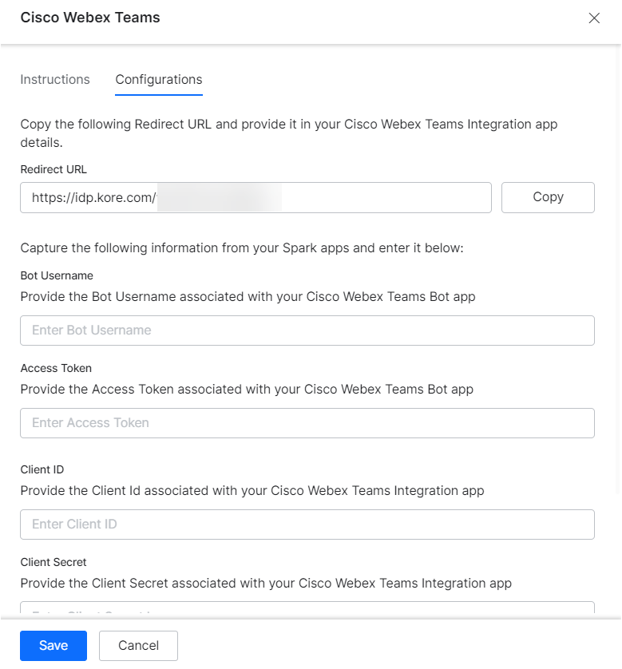

# **Adding the Cisco Webex Teams**

To add the Cisco Webex Teams (formerly Cisco Webex) channel to your VA, the developer must create a dedicated VA app and an integration app in Cisco Webex Teams.

Adding the Cisco Webex Teams channel to your Kore.ai VA is a four-step process to allow end-users to interact with it using their _Webex _accounts.

## Step 1: Create a Bot with Cisco Webex Team

To create a Bot from within Cisco Webex Teams, please follow the steps below:

1. [Log in to the Cisco Webex Developer Portal](https://developer.webex.com/) and proceed to the **Start Building Apps** page or to the **My Webex Apps** page.
2. Click the **Create a New App** option and choose the **Create a Bot** option.

3. Provide all the required information to create the bot and click on **Add Bot**.
4. This step will create a _Bot User_ and an _Access Token_ is also generated for accessing this bot.
5. Make a note of the **Bot Username** and **Access Token** from this page. \

## Step 2: Enable the Cisco Webex Team channel from the XO Platform

1. In the XO Platform, select the assistant you want to add the channel to.
2. Go to **Deploy > Channels**, and select **Cisco Webex Teams**. The channel window opens.
3. Enter the **Bot Username** and **Access Token** from the previous step.
4. Make a note of the **Redirect URL**.

## Step 3: Set Up an Integration with Cisco Webex Team

1. On the Cisco Webex Team Developer portal, click the **Profile** drop-down list on the top-right and go to the **My Webex Apps** page.
2. Click **Create a New App** and choose the **Create an Integration** option to add a new integration app for Webex.
3. Provide all the required details to create the integration like integration name, description, logo, etc. This information must be user-facing as this is displayed to end-users in the permissions dialog.
4. For **Redirect URI(s)**, paste the _Redirect URL_ from the previous step.
5. Under **Scopes**, select **_spark:all_** for enabling bot communication.
6. After providing all the required information, click the **Add Integration** to create the new integration app.
7. This step creates a new integration app and also generates the Client ID and Client Secret for this app.
8. Make a note of the **Client Id** and **Client Secret**.

      For more information, read [Cisco’s documentation](https://developer.webex.com/docs/integrations)

      

  !!! note

           The Redirect URI now includes the **_streamid_** in the API request to identify the virtual assistant being accessed. When an incoming request is qualified with this identifier, it helps with traceability, troubleshooting, and remediation at the network level during anomalies like malicious calls or unusual bot activity.

## Step 4: Complete Cisco Webex Team Channel Configuration from the XO Platform

1. In the XO Platform, on the Channel Configuration page, enter the Post URL where you want Webex **Client ID** and **Client Secret** noted in the previous step.
2. **Enable Channel** to complete the configuration.
3. **Save** the configuration.

After the channel is enabled and all configurations are verified, you can optionally publish the assistant to make it available for end-users, with the new channel. Learn more about[ Publishing your Virtual Assistant](https://developer.kore.ai/docs/bots/publish/publishing-bot/).

To learn more about working with Channels within the Kore.ai XO Platform, please see[ Channel Enablement.](https://developer.kore.ai/docs/bots/channel-enablement/adding-channels-to-your-bot/)
