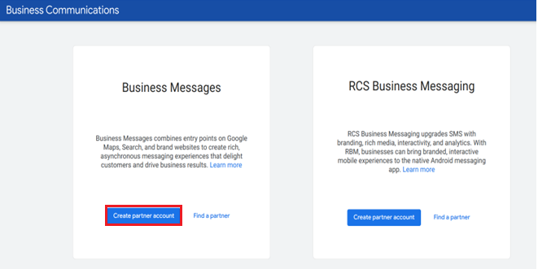
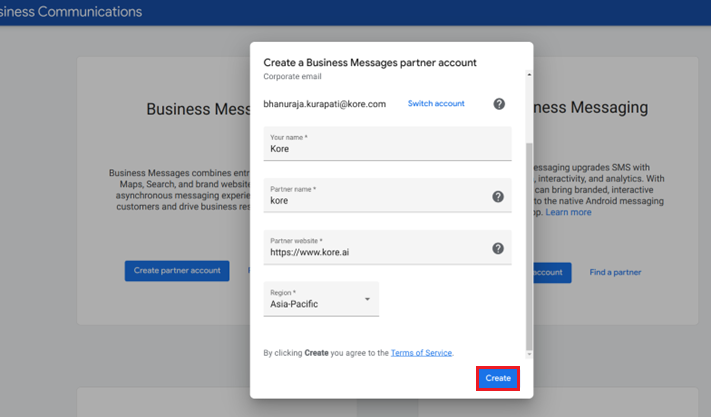
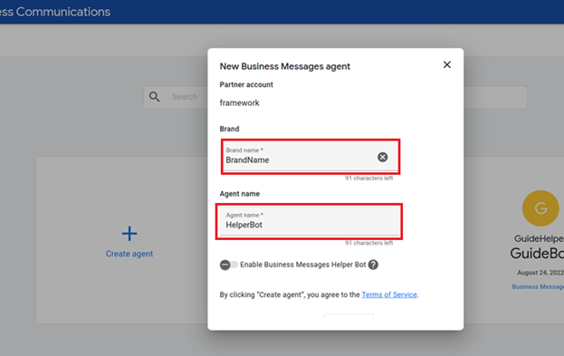
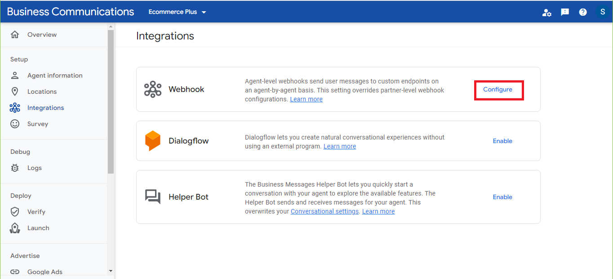
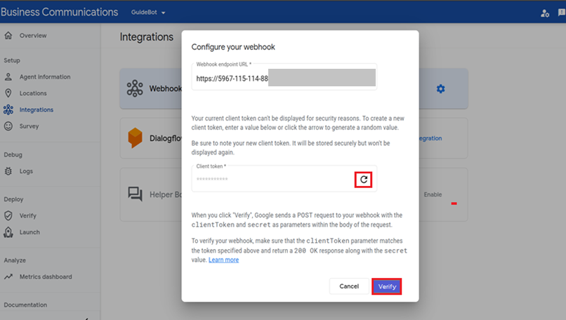
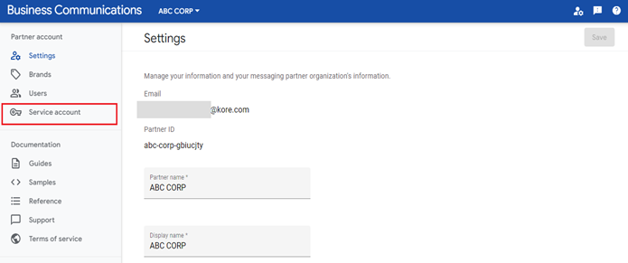
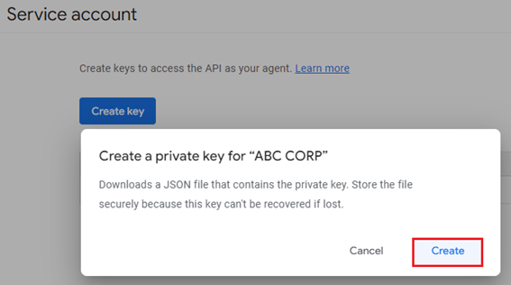
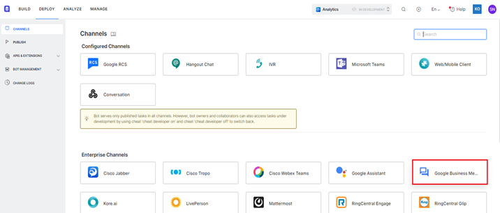
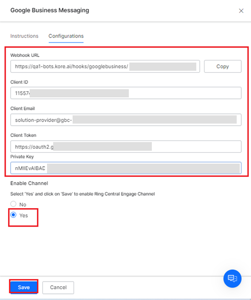

# **Adding the Google Business Messaging Channel**
Modern business applications require agent integrations on web/mobile devices to enable seamless customer communication via SMS/chats.

The **Kore.ai XO Platform** now helps a _Google Business Messaging Partner_ to create rich and asynchronous messaging experiences within apps and during calls through the GBM channel enablement. This feature helps seamlessly integrate real-time business agents to Virtual Assistants.

**Google Business Messaging (GBM)** is a mobile conversational channel that combines digital customer touchpoints or entry points on Google Maps, Search, and brand websites.

## How does it work?

The **Kore.ai XO Platform** registers each Business as a partner with Business Messages and the conversations between the customers and brands will be enabled by creating agents.

Customers can send messages to your brand or its locations through these agents. When a user finds a brand that Kore.ai manages with the business in Google Search or Google Maps.

When a customer clicks the button, a conversation is initiated with the brand’s virtual agent on the device. Businesses can receive and respond to customer messages through an agent, which is a conversational entity that represents business functions, such as website support, and brand locations. Google delivers the message defined as a JSON payload to the Webhook that Kore.ai provides. The agent uses this Webhook and the Conversational Agent API to receive and respond to the customer’s messages.

## Set up on the GBM Channel

The important steps to set up the GBM channel are summarized below:

1. Creating a **Google Cloud Platform (GCP)** project.
2. Submitting the partner information to Google.
3. Enabling the Conversational Agent API.

**Prerequisites**

* An active **Google account**.
* The **Partner Name** field appears in the [Google My Business (GMB) Console](https://www.google.com/business/) for locations associated with the agents you manage.
* A **webhook endpoint URL** that can accept messages (Kore.ai generates the webhook URL, which will be associated with a virtual assistant built on the platform).

**Create a Google Cloud Platform Project**

You must create and register a **Google Cloud Platform (GCP)** project to enable the Google Cloud API service for your partner account. [Learn more](https://cloud.google.com/resource-manager/docs/creating-managing-projects).

!!! tip

         Please note the project number to register as a partner.

## GBM Channel Enablement on the Platform

To set up the GBM channel on the Kore.ai XO Platform and launch the agent, follow the steps below:

1. [Register as a Google Business Messaging Partner](https://developer.kore.ai/docs/bots/channel-enablement/adding-the-google-business-messaging-channel/#Step1_Register_as_a_Google_Business_Messaging_Partner).
2. [Create an agent for your account](https://developer.kore.ai/docs/bots/channel-enablement/adding-the-google-business-messaging-channel/#Step_2_Create_an_Agent_for_your_Account).
3. [Set up the Webhook for the agent](https://developer.kore.ai/docs/bots/channel-enablement/adding-the-google-business-messaging-channel/#Step_3_Set_up_the_Webhook_for_the_Agent).
4. [Create a Service Account Key](https://developer.kore.ai/docs/bots/channel-enablement/adding-the-google-business-messaging-channel/#Step_4_Create_a_Service_Account_Key).
5. [Configure the Virtual Assistant for the service account](https://developer.kore.ai/docs/bots/channel-enablement/adding-the-google-business-messaging-channel/#Step_5_Configure_the_Virtual_Assistant_for_the_Service_Account).

## Step1: Register as a GBM Partner

To integrate with the GBM channel, you need to register as a partner for Google Business Messaging with the steps below:

1. Open the [Business Communications Developer Console](https://business-communications.cloud.google.com/?utm_source=/business-communications/business-messages/guides/how-to/register&utm_medium=devsite&utm_campaign=business-messages).
2. Under **Business Messages**, click **Create partner account**.

3. Enter the values for the following fields in the **Create a Business Messages partner account** window:
 * Your Name
 * Partner Name
 * Partner Website
 * Region
4. Click **Create**.

## Step 2: Create an Agent for your Account

To create an agent for your GBM Partner account, you must submit information on the brand and the agent on the **Business Communications Developer Console** with the steps below:

!!! note

         To manage multiple brands, you must create an agent for each brand.

1. Sign in to your account on the [Business Communications Developer Console](https://business-communications.cloud.google.com/?utm_source=/business-communications/rcs-business-messaging/guides/get-started/first-agent&utm_medium=devsite&utm_campaign=rcs-business-messaging).
2. Click **Create Agent**.

3. Enter the values for the **_Brand name_** and **_Agent name_** fields.

4. Select **Enable the Business Messages Helper Bot** to activate the agent.
5. Click **Create Agent**.
6. Click your agent’s name when your agent is available.

Please ensure you have the following values before you create an agent:

* Brand name
* Brand website
* Agent name to appear in conversations with users.
* Agent logo as a publicly available URL.
* Agent welcome message
* Live chat hours
* A physical location of the brand for testing purposes. Please avoid the corporate headquarters or other locations not represented by the brand agent.
* Partner name
* Partner ID
* GCP project number
* (Optional) Business ID identifies the brand in messages the webhook receives.
* Escalation of contact name, email, and phone number.

!!! note

         Once your agent is available, you can add the business and branding information.

## Step 3: Set up the Webhook for the Agent

After creating the agent, you need to copy the **Webhook URL** from the Kore.ai Platform and generate the **Client Token** for the agent to integrate for messaging and events. To set up the agent webhook, follow the steps below:

1. Open the [Business Communications Developer Console](https://business-communications.cloud.google.com/?utm_source=/business-communications/business-messages/guides/how-to/agents&utm_medium=devsite&utm_campaign=business-messages) and sign in with your **Business Messages Google** account.
2. Click on the panel with your agent’s name.
3. On the **Business Communications **page, click **Integrations** on the left menu.
4. For the **Webhook** option, click the **Configure** link.

5. Copy the **Webhook URL** from the Kore.ai XO Platform under **Deploy** > **Channels** > **Google Business Messaging** > **Configurations**.

6. Paste the copied link for the **Webhook endpoint URL** field in the **Configure your webhook** window on the **Business Communications Developer** Console.

7. Click the **Refresh** icon for the **Client token** field to generate the **Client token**.
8. Click **Verify**.

The **GBM platform** sends a **POST** request to the Kore.ai XO Platform’s webhook with the **_ClientToken_** and **_Secret Key_** parameters for verification before sending/receiving messages.

## Step 4: Create a Service Account Key

To send messages and events as your agent, you need to authenticate API calls with a service account key. The **Business Communications Developer Console** creates a service account for you, but you need to create a unique key to access your agent with the steps below:

1. On the left menu, click **Service account**.

2. Click the **Create key** button.

3. Click **Create** on the confirmation window to download the JSON file with the **service account key**.

 

4. Rename the downloaded file to **_rbm-agent-service-account-credentials.json_**.
5. Store the key securely to recover it if required.

## Step 5: Configure the Virtual Assistant for the Service Account

To configure the virtual assistant for the service account on the Kore.ai XO Platform, follow the steps below:

!!! tip

         For the private key, please copy only the key value within the **_BEGIN PRIVATE KEY_** and **_END PRIVATE KEY_** header tags. The XO Platform adds these tags by default.

1. Copy the **_client_email_**, **_client_id_**, **_token_uri_**, and **_private_key_** values from the downloaded JSON file.
1. Paste the values in the respective fields under **Deploy** > **Channels** > **Enterprise Channels** > **Google Business Messaging** > **Configurations**.

  

   

2. Select **Yes** for the **Enable Channel** option.
3. Click **Save**

After enabling the channel and verifying all the configurations, you can test the new channel integration by publishing your virtual assistant. [Learn more](https://developer.kore.ai/docs/bots/publish/publishing-bot/).

To learn more about working with messaging channels within the Kore.ai XO Platform, please see[ Channel Enablement.](https://developer.kore.ai/docs/bots/channel-enablement/adding-channels-to-your-bot/)
