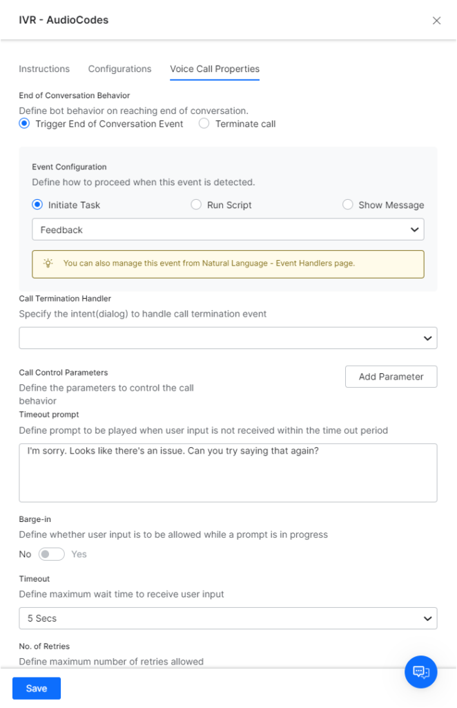

# **Adding the IVR-AudioCodes Channel**

You can connect your assistant to AudioCodes using a Webhook based integration. Before you begin, please ensure that you have administration access to your AudioCodes account.

# Step 1: Associate an App

1. In the XO Platform, select the assistant that you want to add AudioCodes IVR to.
2. Go to **Deploy > Channels > IVR-Audiocodes**.
3. Navigate to the **Configurations **tab of this page and associate a secure app by choosing an existing app or by creating a new one.
4. Generate the JWT token using the details of the selected app and use this token for secure communication with the Kore.ai XO Platform.

 

# Step 2: Configure the Bot URL in AudioCodes

The Webhook URL associated with this assistant should be configured in your AudioAccounts account. Navigate to the **Configurations **tab of this page, copy the Webhook URL, and configure it as the _botURL _in the **VoiceAI Connector** of your AudioCodes account. See the [AudioCodes documentation ](https://techdocs.audiocodes.com/voice-ai-connect/Content/VAIG_API/API_1.htm)for further details.

# Step 3: Configure Voice Call Properties

Make sure to configure the properties under the Voice Call Properties tab for defining the default voice interaction experience for your customers. [Learn more about configuring Voice Call Properties](https://developer.kore.ai/docs/bots/bot-builder-tool/dialog-task/voice-call-properties/).

 

# Step 4: Enable the Channel

On the Configurations tab, select Yes, then Save your configuration in order to enable the channel.

 

After the channel is enabled and all configurations are verified, you can optionally publish the assistant to make it available for end-users, with the new channel. Learn more about[ Publishing your Virtual Assistant](https://developer.kore.ai/docs/bots/publish/publishing-bot/).

To learn more about working with Channels within the Kore.ai XO Platform, please see[ Channel Enablement.](https://developer.kore.ai/docs/bots/channel-enablement/adding-channels-to-your-bot/)
