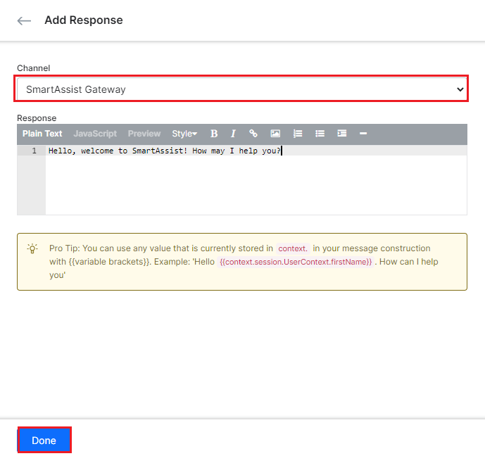

# **Adding the SmartAssist Gateway Channel**

**SmartAssist** is a Kore.ai Contact Center Automation Solution. It helps enterprises manage their contact center infrastructure from the omnichannel interface, voice infrastructure, gateway, and live agent interactions, including agent assistance. [Learn more](https://docs.kore.ai/smartassist/getting-started/introduction/).

Applications built on SmartAssist use the Kore.ai XO Platform’s **IVR-Audiocodes** channel via the underlying voice gateway interface for virtual assistant interactions. Kore.ai’s native voice gateway, **SmartAssist Gateway**, is now configured as a new Kore.ai XO platform channel to drive and manage virtual assistant conversations using open-source components.

## Important Considerations

1. SmartAssist Gateway, when configured as a new channel, lets you set up **Voice Call Properties**, and the channel overrides on SmartAssist.
2. You cannot enable this channel via the XO Platform. Alternatively, you must enable the channel for the required app on SmartAssist.
3. However, you should configure channel overrides from the XO Platform in the **Voice Call Properties** section for the new channel.
4. The channel supports the channel-level Voice Call Properties supported by the **IVR-AudioCodes** channel. [Learn more](https://developer.kore.ai/docs/bots/bot-builder-tool/dialog-task/voice-call-properties/).
5. The _Telephony Welcome_ event applies to the channel.
6. The system behavior for the End_ of task_ event is the same as that of AudioCodes.
7. Channel overrides are supported for prompts.
8. Node-level (Dialog, FAQ, Standard Responses, Events, etc.) **Voice Call Properties** are supported for the channel.

## Configuration Overview

To accomplish the channel enablement, you must do the following:

1. Create a new SmartAssist Application to associate with the channel or select an existing app for the association. The [steps](https://developer.kore.ai/docs/bots/channel-enablement/adding-the-ivr-audiocodes-channel-2/#Step_1_Associate_an_App) are similar to the **IVR-Audiocodes** channel.
2. [Configure](https://developer.kore.ai/docs/bots/channel-enablement/adding-the-ivr-audiocodes-channel-2/#Step_3_Configure_Voice_Call_Properties) the **Voice Call Properties**, and define the **Channel-specific Prompts** and **Messages** for any Virtual Assistants connected to your SmartAssist application.

## Prerequisites

Before configuring the **SmartAssist Gateway** channel, please ensure the following:

1. You have a SmartAssist account.
2. You’ve completed the voice channel configurations on SmartAssist. [Learn more](https://docs.kore.ai/smartassist/channels/voice/).
3. You have associated an app with the channel.

## Configuration Steps

Once you’ve created a SmartAssist app on SmartAssist, follow the steps below to complete the channel configuration:

**Note**: This channel is auto-enabled when you create a new SmartAssist application.

### Define the Voice Call Properties

To define the voice call properties specific to the SmartAssist Gateway, follow the steps below:

1. Navigate to **DEPLOY** > **CHANNELS**, and click **SmartAssist Gateway** under **Voice Channels**.

2. Click the **Voice Call Properties** tab in the **SmartAssist Gateway** window. [Learn more](https://developer.kore.ai/docs/bots/bot-builder-tool/dialog-task/voice-call-properties/) on **Voice Call Properties**.

### Step 1: Configure the End of Task Behavior

Select one of the following options for _End of Task Behavior_ to define the bot behavior on reaching the _End of task_ flow:

* **Trigger End of Task Event**: When this event is triggered, the bot ends the call and initiates any task like Feedback Survey, Fallback, Dialog generation, etc., linked to the event.
* **Terminate call**: The bot ends the call without triggering any event-based tasks.

### Step 2: Event Configuration

To define the follow-up task when an event is detected, follow these steps:

!!! note

    You can also manage this event from the **Natural Language** > **Event Handlers** page.

1. Select one of the following options:
 * **Initiate Task**: Initiates the task you select from the list.
 * **Run Script**: Run the script code you define.
 * **Show Message**: Displays the response message you define.
 * After selecting **Show Message**, click the **+ Add Response** button.
 

 * Select **SmartAssist Gateway** from the list for **Channel** in the **Add Response** window.
 * Add the response text in the input field for **Response**.
 * Click **Done**.
 

 !!! tip

    You can use any value currently stored in the `context` variable of your message construction with `{{variable brackets}}`. For example, ‘Hello `{{context.session.UserContext.firstName}}`. How can I help you?’ This helps personalize the response message.

### Step 3: Select the Call Termination Handler

Select the intent(dialog) you previously created from the list to handle the **Call Termination** event. This initiates the relevant task for the event flow.

### Step 4: Define the Call Control Parameters

Define the parameters to control the call flow behavior by following the steps below:

1. Click **Add Parameter**.
2. In the **Add Call Control Parameter** window, input the **Parameter name** and **Parameter value**.
3. Click **Save**.

The new **call control parameter** is listed on the **SmartAssist Gateway** window, as shown below. \
 

### Step 5: Define the Timeout Prompt

To define the prompt played when the user input is not received within the timeout period, follow the steps below:

1. First, provide the text in the **Timeout prompt** input field.
2. Next, hit enter.

### Step 6: Define User Input Parameters

To define the key parameters for user input management, follow the steps below:

1. First, provide values for the following fields:
 * **Barge-in**: Select _YES_ to allow the user’s input while a prompt is in progress. Otherwise, select _No_.
 * **Timeout**: Select an option from the list (0 seconds to 60 seconds) to define the maximum wait time to receive the user’s input.
 * **No. of Retries**: Select an option from the list (1 to 10) to define the maximum number of user input retries allowed.
2. Next, click **Save**.

!!! note

  You don’t have to enable the channel explicitly since it is auto-enabled.
    
After the channel is enabled and all configurations are verified, you can optionally publish the assistant to make it available for end users with the new channel. Learn more about[ Publishing your Virtual Assistant](https://developer.kore.ai/docs/bots/publish/publishing-bot/).

To learn more about working with Channels within the Kore.ai XO Platform, please see[ Channel Enablement.](https://developer.kore.ai/docs/bots/channel-enablement/adding-channels-to-your-bot/)
