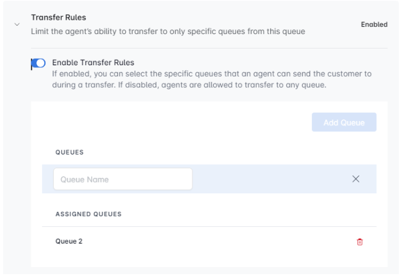
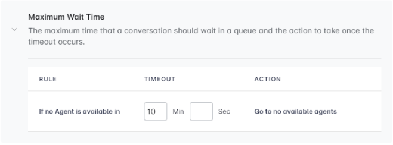
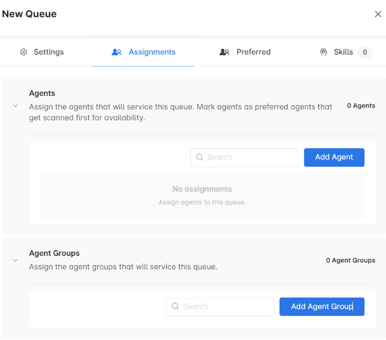
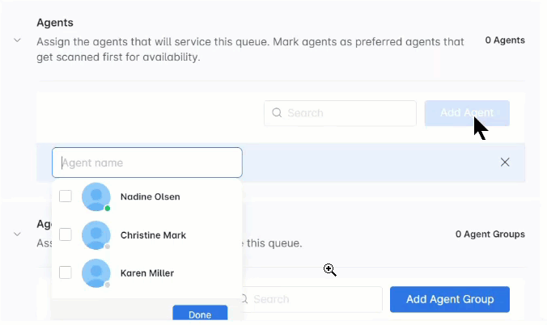
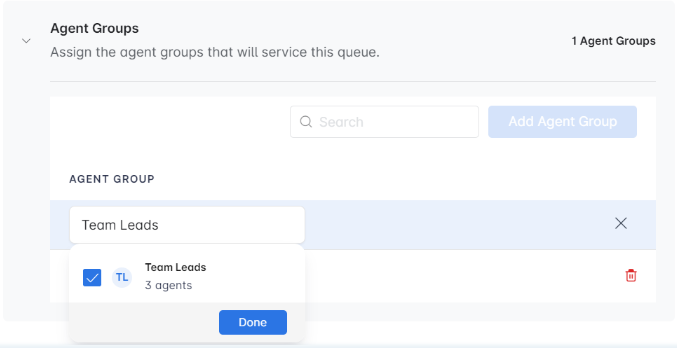
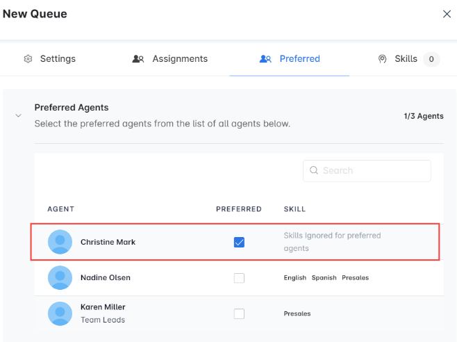
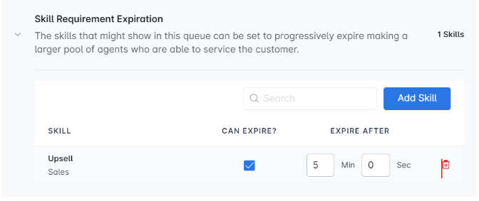
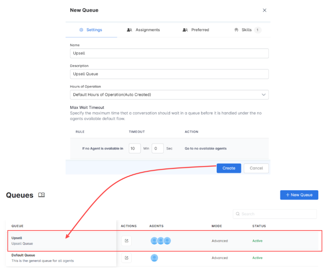

# **Queues**

**Queues** are virtual, temporary waiting rooms that hold and process incoming requests for conversations between agents and customers. These are the holding areas for digital and audio conversations waiting for an agent to be assigned. 

All conversations get assigned to queues based on the agent selection logic and skill proficiency match. A conversation can only be in one queue at any given time. Once conversations get assigned to a queue, SmartAssist assigns them to agents. The agent assignment works based on pre-established rules and criteria, as shown in the illustration below:

Once a conversation comes in, it gets assigned to a queue. Afterward, the next step is to check the routing mode. 

The **Simple Routing** mode checks for agent skills and agent availability. After the skill and availability match, an agent gets assigned to the conversation.

The **Advanced Routing** mode checks for preferred agents. If a queue has preferred agents configured, admins can specify a time, after which the routing extends to skill match. If a preferred agent becomes available before the configured time expires, they will have priority over agents selected via skill match.

For the agent to answer the conversation, they must have a required skill attached to their profile. The conversation cannot be assigned to the agent if the skill does not match.

It is possible, however, to define a skill and its expiry period. SmartAssist will search for an agent with this skill for the configured time. If no agent with this skill is available before the skill expiration period ends, the skill is no longer considered a requirement.

## Queue Routing Modes

All conversations will get assigned to queues as they come in. This process is based on two Routing modes, as described below.

**Standard Routing**

* Queue routing is primarily based on the highest average skill and proficiency match for a given conversation. This routing mode only considers proficiency after a skill match has occurred.
* If multiple agents match a skill, the routing is done based on currently utilized slots. Agents with fewer utilized slots get priority, as per proficiency thresholds. Also, agents get prioritized if more time has passed since their last conversation compared to other agents.

**Advanced Routing** 

* In this case, the conversation first routes to a preferred agent. 
* For each new conversation, SmartAssist checks preferred agents (if any) for availability. During a preferred agent check, skills are ignored. If a preferred agent is not assigned and the preferred agent timeout expires, the check is expanded to the full agent list, and skills are matched to select the best available agent (according to the Simple Routing Mode).

## The Queues Live Board

To access _Queues **,**_ go to **Contact Center > ROUTING > Queues**.\

This section displays the following:

* **Search:** Enter keywords to find queues by name;
* **Queue:** The name and description of available queues;
* **Actions:** Lists the **Edit Queue** option;
* **Agents:** Shows the agents available for a particular queue;
* **Mode:** Specifies whether the queue is set to the **Simple** or **Advanced** routing mode;
* **Status:** Displays the status of the conversation, **Active** or **Inactive**.

## Add a Queue

1. At the top-right corner of the Configuration page, Click **New Queue**.
2. In the **New Queue** window, you can set up the queue as follows:\

    1. With **Simple Routing**, you can configure the Queue Settings and Assignments;  
    2. With **Advanced Routings**, you can configure the Queue Settings, Assignments, Preferred Agents, and Skills.

### Settings

This section is available in _Simple_ and _Advanced Routing_ modes and allows you to configure the following:

1. The **Name** by which to identify the queue;
2. A short **Description** of the queue (optional);
3. **Hours of Operation**: Select from the available [hours of operation](https://docs.kore.ai/smartassist/settings/hours-of-operation-2/).\

4. **Transfer Rules:** This feature lets you limit the agents’ ability to transfer from one queue to another. If this feature is enabled, you can select the specific queues to which agents can transfer customers. If disabled, agents can transfer to any queue from the current one.\

!!! Note

If the customer ends the chat before the completion of a transfer, then the transfer will be dropped, and the interaction will not be assigned to any queue or agent. This feature only applies to chat conversations and is available if you are using Kore WebSdk v1.0. \

5. **Maximum Wait Time**: Specify the maximum time a conversation should wait in the queue before the default _No available agent_ flow handles it.\

6. Enable **Advanced Routing**: Preferred agents and skill dropoffs will be available if you enable this option.\

### Assignments

This section is available in _Simple_ and _Advanced Routing_ modes and allows you to assign agents, agent groups, or both to the queue.

#### Assign Agents

Follow these steps to assign agents to a queue: 

1. Click **Add Agent**;
2. **Click the checkbox next to an agent’s name** to select it. You can use the _Search_ field at the top of the list to find a specific person.\

#### Assign Agent Groups

1. Click **Add Agent Group**;
2. Click the checkbox next to the name of a group to select it. You can use the _Search_ field at the top of the list to find a specific group.\

!!! Note

Agents from the agent group are not displayed in the agent’s list. The list of agents added to the queue is displayed, along with the agent groups that are part of the queue.

From the monitor screen, you can see the consolidated list of agents that are part of the queue.

### Preferred Agents

In the **Preferred** tab, you can assign preferred agents to the queue.

1. Under **Preferred Agents**, find the agent you need in the list. You can use the _Search_ field for this purpose. Select the corresponding **Preferred** checkbox to set the agent as preferred.\

2. Under **Advanced Settings**, configure the preferred agent timeout. During a preferred agent check, skills are ignored. If a preferred agent is not assigned and the preferred agent timeout expires, the check expands to the full agent list, and skills match to select the best available agent for the conversation.\

### Skills

1. In the **Skills** **tab**, search for a specific skill to assign to the Queue.\

2. Choose whether you want the skill to expire and set the time for this. Once a skill assignment expires, the conversation routes to other assigned skills.\

When you are ready to save the Queue, click **Create**. The new Queue is then listed among your available queues. You must configure at least the _Settings_ and _Assignment_ tabs to save a queue.\

## **Edit a Queue**

1. Click the **Edit** icon corresponding to the queue you want to edit.\

2. Make the required changes and click **Save**.

## Delete a Queue

To delete a queue, follow these steps:

1. Click the **Edit** icon corresponding to the queue you want to edit.
2. Click the **Delete (bin)** button on the right of the bottom toolbar.\

3. **Confirm** your choice.

!!! Note

Deleting a queue means that all corresponding routing rules are removed.

## Assign a Conversation to a Queue

There are two ways to assign a conversation to a queue:

1. Using the _[Set Queue](https://docs.kore.ai/smartassist/experience-flows/set-queue/)_ node within an experience flow.
2. Using the [agentUtils.setQueue()](https://docs.kore.ai/smartassist/utils/script-nodes-call-flows-agent-utils/#Set_Queue) method.