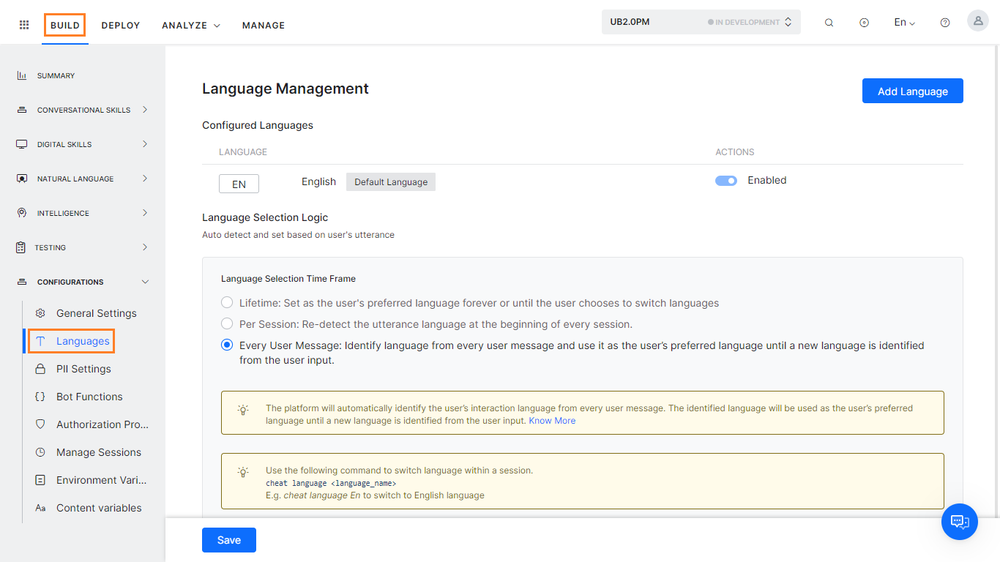

# **Enabling Additional Languages for the Universal Bot**

Like standard bots, you can enable more than one language for universal bots, but the functionality is completely different.

When you enable a new language for a standard bot, you need to upload language packs consisting of the entire bot definitions. Whereas to enable a new language for a universal bot, you just need to set up the corresponding default dialog.

Universal bots do not obtain the enabled languages of the linked bots. You must enable default and additional languages for the universal bot. When user utterances are made in an enabled language, the universal bot routes it to only those linked bot tasks that have the same language enabled. For example, if German is enabled for the universal bot and a user utters in German, the NLP engine looks for all the linked bot tasks that support German and sends the utterance only to those tasks.
!!! note

    If a user interacts with the universal bot in a non-enabled language, it sends a standard response in the default language requesting the user to interact in one of the supported languages. Also, if none of the linked tasks have a relevant response, the bot triggers the language-specific default dialog.

**Before you Begin**

This article assumes that you understand the fundamentals of multi-language bots in Kore.ai and therefore focuses on the aspects specific to the universal bots. For the fundamentals of multi-language bots in the Bots Builder, refer to[ Building Multi-Language Bots](https://developer.kore.ai/docs/bots/advanced-topics/multi-lingual/building-multi-language-bots/).

### **Enable Language**

Follow these steps to enable an additional language for a universal bot:

1. Open the universal bot for which you want to configure new language.
2. Select the **Build** tab from the top menu.
3. From the left menu select **Configurations -> Languages**. 
    

4. Click the **Add Language** button from the top right.
5. On the Add Language window, click **Configure **next to the language you want to.

    !!! note
    
        The language would be enabled only for the Universal Bot, ensure that this language is enabled and published in the linked bots as well. 

6. Under the **Language Selection Time Frame** (scroll down to view this option) select one of these options:
    * **Lifetime**: The auto-detected language or the language preference selected by the user will be set as the user’s preferred language.
    * **Per Session**: Detects the user’s language at the beginning of every session and responds accordingly.

    !!! note
    
        If the language cannot be determined with high confidence, the bot requests the users to select their preferred language. The default language is used to communicate with the user during language preference selection.

7. Click **Save**.

### **Customizing Default Dialog**

If the Kore.ai NLP engine cannot recognize the user intent, the universal bot responds to the users with the default dialog. You must create language-specific versions of the default dialog for each enabled language so that such bot responses go in the users’ preferred language. Otherwise, the universal bot responds applies the default bot language regardless of the user’s preferred language. 
 Follow these steps to open the language-specific default dialog:

1. Open the universal bot whose language-specific default dialog you want to change.
2. On the top-right side of the bot window, click the name of the current bot language, and select any of the enabled languages. It switches the bot language as per your selection.

Once you switch the language, go to the Default Dialog of the bot and make the necessary changes as explained in the[ Customizing the Default Dialog](https://developer.kore.ai/docs/bots/advanced-topics/universal-bot/customizing-the-universal-bots-default-dialog-task/) article.

		
