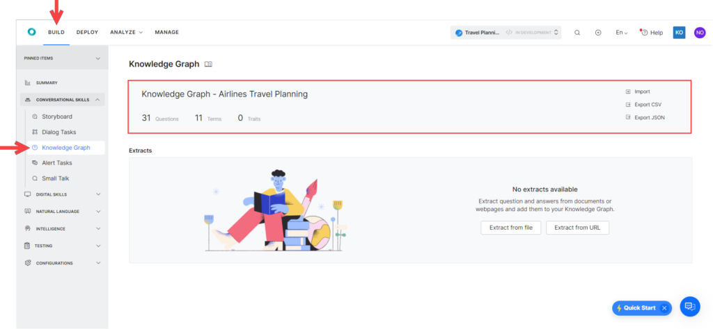
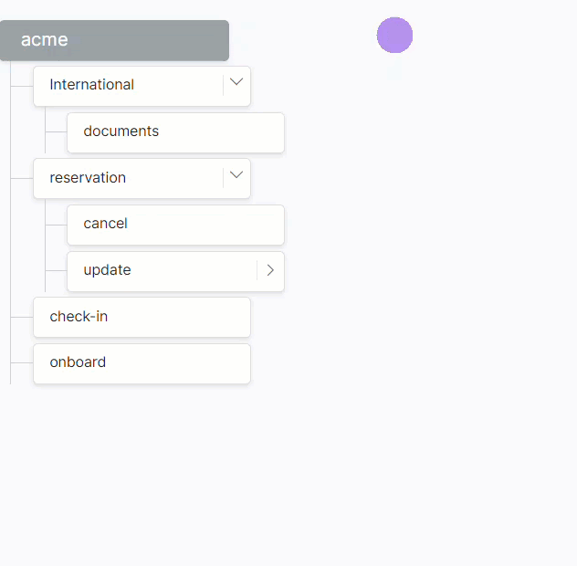
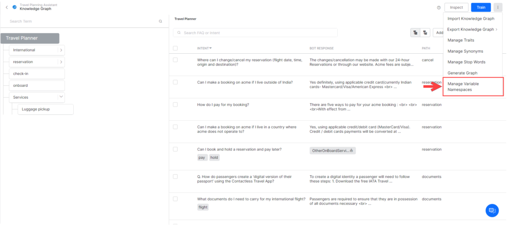
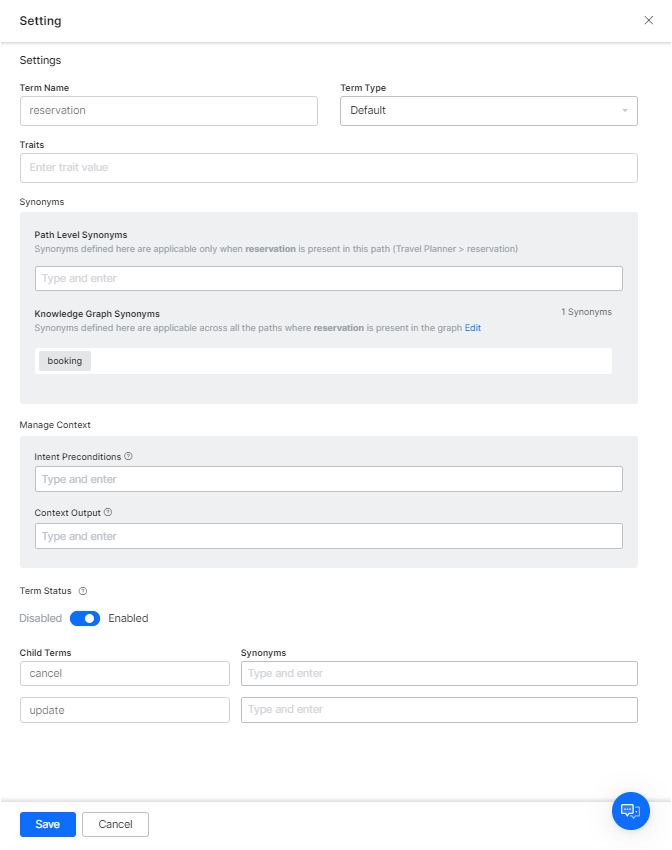
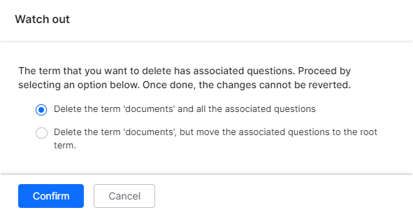
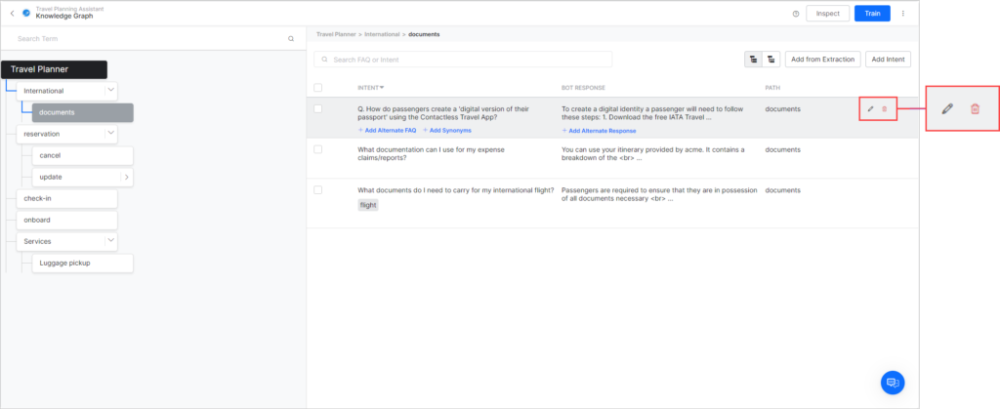

# **Build a Knowledge Graph**

The XO Platform’s Knowledge Graph (KG) helps you turn your static FAQ text into an intelligent, personalized conversational experience. It goes beyond the usual practice of capturing FAQs as flat question-answer pairs. Instead, the Knowledge Graph enables you to create a hierarchical structure of key domain terms and associate them with context-specific questions and their alternatives, synonyms, traits, and more. Additionally, you can opt for the LLM-based Few-Shot Knowledge Graph, which requires no ontology and reduces maintenance and training requirements. [Learn more](https://developer.kore.ai/docs/bots/bot-builder-tool/knowledge-task/knowledge-graph-terminology/).

To generate a Knowledge Graph, you need to add FAQs to an existing or new VA. If you have not created a VA, refer to [Building a Virtual Assistant.](https://developer.kore.ai/docs/bots/chatbot-overview/getting-started-bots/).

To open the Knowledge Graph builder, follow the below steps:

1. Log in to the XO Platform and open the VA to which you want to add the Knowledge Graph.
2. Select the **Build** tab from the top menu.
3. On the left menu, select **Conversation Skills** and click **Knowledge Graph**.
4. You will notice that there is already a Knowledge Graph with the name of your assistant.

> **Note**:
All features explained here are supported by the Few-Shot Knowledge Graph, except for the following:
>
>  * Few-Shot Knowledge Graphs do not require an ontology structure, but you can create one to  improve intent detection. 
> * Default terms are not available in Few-Shot Knowledge Graphs. The only exception is when you switch from an Ontology Graph, in which case existing Default terms are stored as such until updated. Afterward, Default terms become Organizer terms and can be set as Mandatory.
> * Lemmatization using Parts of Speech, Search in Answer, and Contextual Paths Qualification are not supported by Few-Shot Graphs. Please see the Knowledge Graph Types Comparison Table for a detailed list of supported features.
> * Path Level and Knowledge Graph Synonyms are only supported for Mandatory Terms and for Tags.

## Create the Knowledge Graph Node Structure

By default, the name of the VA becomes the root node of the hierarchy and you can edit this. Create the rest of the nodes below the root node.

To create nodes, follow the below steps:

1. Open the Knowledge Graph.
2. On the top left of the Knowledge Graph window, hover over the root node.
3. Click the **+** icon. A text box appears below to **Add Node**. For better performance, there is a restriction of 50k FAQs spread across 20k maximum allowed number of nodes.
4. Type the name of the node in the text box and press **Enter**. A warning would be displayed in case you enter a duplicate node name, i.e. if a child node with the same name already exists under the parent node.
> **Note**: This node becomes a child for the root node and can be referred to as a First-level node.
5. Repeat steps 1 to 3 in this section to create other First-level nodes.
6. After you create First-level nodes, create child nodes as follows:
    * Hover over any First-level node, and click the plus icon to create its child node.
    * You can create a child node for any level node by hovering over it and clicking the **+** icon.

Follow the same process to create multiple node levels. 

The demo below shows you how to create nodes.

You can delete nodes by clicking the **Delete** icon on the right.

## Build the Knowledge Graph

The next step is to add Knowledge Graph Intents which can be either:

* **FAQ** to answer user queries
* **Task** to execute a dialog task.

### Add FAQs

Using this option, you can add relevant question-answer sets to the nodes in the hierarchy. Note that there is a limit  of 50k FAQs over 20k nodes to avoid performance issues. [Learn more](https://developer.kore.ai/docs/bots/bot-builder-tool/knowledge-task/managing-faqs/).

### Run a Task

To leverage the capabilities of the Knowledge Graph and dialog tasks, and handle FAQs that involve complex conversations, you must link a dialog task to a Knowledge Graph Intent 

1. On the Intent window, under the **Intent** section, select **Task**.
2. Optionally, enter a **Display Name.** This name will be used for presenting the FAQ to the end-users in case of ambiguity.
3. Select a task from the drop-down list. You can **Add Utterance** that triggers this task.
4. If multiple utterances mean the same, **Add Alternate Utterance**.
5. You can also add a **Reference Id**. This field can be used to add a reference to any external content used as a source for this FAQ.
6. Click **Save**.

### Manage Traits, Synonyms, and Stop Words

You can improve the performance of your Knowledge Graph by adding tags, synonyms, traits, and more. [Refer here](https://developer.kore.ai/docs/bots/nlp/knowledge-graph/) to know more.

### Manage Variable Namespaces

**Manage Variable Namespaces** section (introduced in v8.0) allows you to associate the Variable Namespaces to use with this Knowledge Graph. This option is visible only when the Variable Namespace is enabled for the VA. For more information, refer to [Managing Namespace](https://developer.kore.ai/docs/bots/bot-settings/bot-management/managing-namespace/).

## Update a Knowledge Graph

Once created, there will be times when you want to make changes to the Knowledge Graph for better organization and presentation.

> **Note**: Once you make any changes to the Knowledge Graph, make sure to click Train on the top-right to send the updates to the Knowledge Graph engine. If you do not train the VA, the changes are not reflected in its responses.

By default, intents added to a child node are visible for all its parent nodes in the path, up to the root node. 

If you do not want the intents from child nodes to be seen beyond a certain parent node, click the following icon on the **Questions** pane of the selected parent.

The intents from all its child nodes are visible to the selected parent node and not to all its parent nodes.

### Move Intents Between Nodes

You can move one or more Intent and Response sets between nodes in your Knowledge Graph, as follows.

1. On the Knowledge Graph, click the name of the node from which you want to move the intent. The intents associated to the node display on the right pane.
2. Identify the intent that you want to move, and select the checkbox next to it. You can select multiple items.
3. Drag the intent and drop it on the relevant node. The node is highlighted and the intent displays on the right pane of the node.

The demo below shows you how this works.

### Edit and Delete Terms

1. On the nodes hierarchy from the left pane, hover over the term/node you want to edit.
2. Click the **Settings** (gear) icon. The settings window opens.
3. You can change the name of the term, set the term types, set the term status, add traits, add or remove synonyms, and manage context. [Learn more](https://developer.kore.ai/docs/bots/nlp/knowledge-graph/). 

To delete a term, follow the steps below:

1. On the nodes hierarchy, hover over the term you want to delete.
2. Click the **Delete** icon.
3. On the confirmation dialog box, you can find the following options:

* **Delete the FAQs along with the term** – Choosing this option deletes the term and FAQs under it.
* **Delete the term and move FAQs to root term** - Choosing this option deletes the term and moves the FAQs under it to the root term.

> **Note**
>
> * If the term has child nodes, all those nodes will be deleted.

> * If your VA is already published, you must train it  for the deletions to be effective.
> * If you have deleted the first level term you can selectively train to remove the related terms from the published copy.
> * If you have deleted, say, the nth level child term, then you need to select the entire parent term for training.

### Edit Intents and Responses

1. From the nodes hierarchy, select the relevant term.
2. Intents associated with the term appear on the right pane.
3. Hover over the intent or response to edit it and click the **Edit** icon.
4. Make changes to the intent or response and click **Save**.
5. You can delete the intent using the **Delete** icon.

6. Selecting multiple intents lets you delete them in bulk.

## Improve Performance

The Knowledge Graph engine works well with the default settings, but you can fine-tune the KG engine performance. Here are a few guidelines:

1. Configure the Knowledge Graph by defining terms, **synonyms, primary and alternative questions, or user utterances.** Though hierarchy does not affect the KG engine performance, it does help organize and guide your knowledge implementation.
2. Set the following parameters:

 * **Path Coverage** – For Ontology-based graphs, you can define the minimum percentage of terms in the user’s utterance to be present in a path to qualify it for further scoring.
 * **Definite Score for KG** – Define the minimum score for a KG intent match to consider as a definite match and discard any other intent matches found.
 * **Minimum and Definitive Level for Knowledge Tasks** – Define minimum and definitive threshold to identify and respond in case of a knowledge task.
 * **KG Suggestions Count** – Define the maximum number of KG/FAQ suggestions to present when a definite KG intent match is unavailable.
 * **The proximity of Suggested Matches** – Define the maximum difference to allow between top-scoring and immediate next suggested questions to consider as equally important. 
 * **Qualify Contextual Paths** – This ensures that the bot context is populated and retained with the terms/nodes of the matched intent. This further enhances the user experience.

> **Note**: You can customize these settings in Natural Language > Thresholds & Configurations. See Knowledge Graph Training for details.

 * **Traits** – Traits qualify nodes/terms even if the user utterance does not contain the term/node. Traits are also helpful in filtering the suggested intent list.

